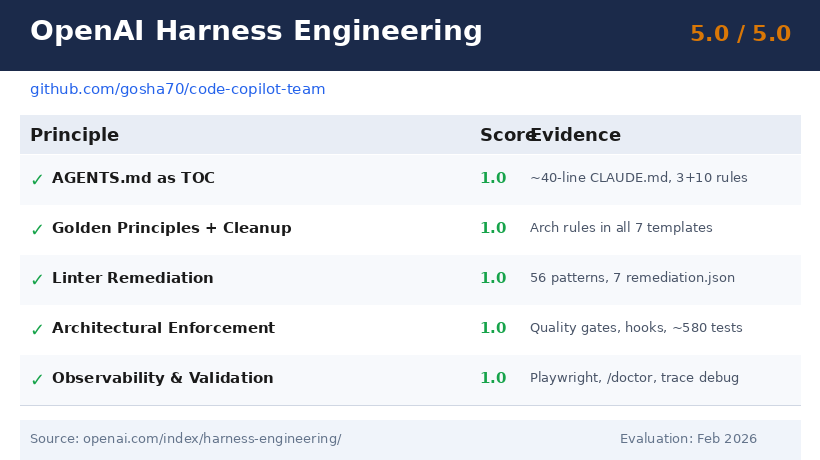
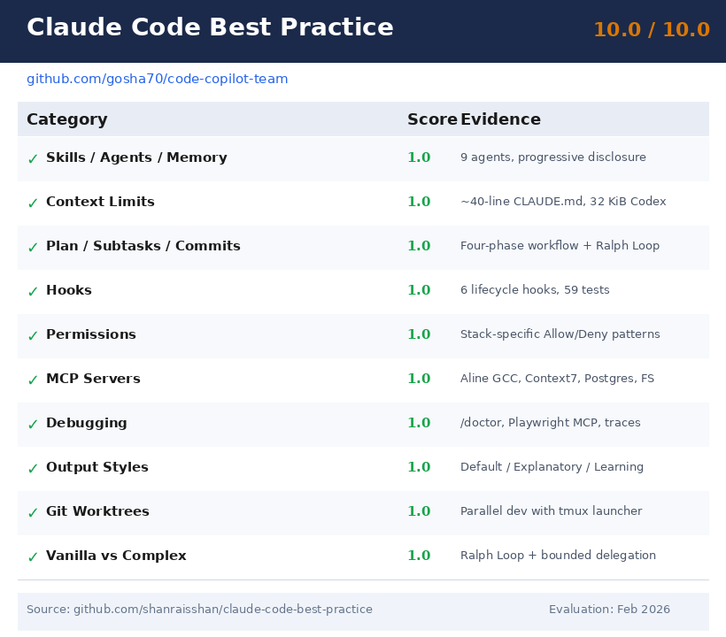
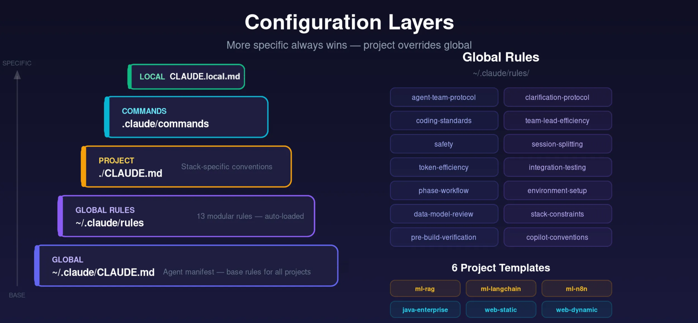
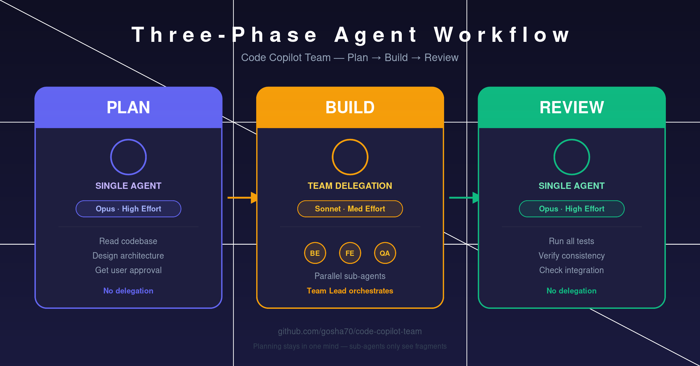
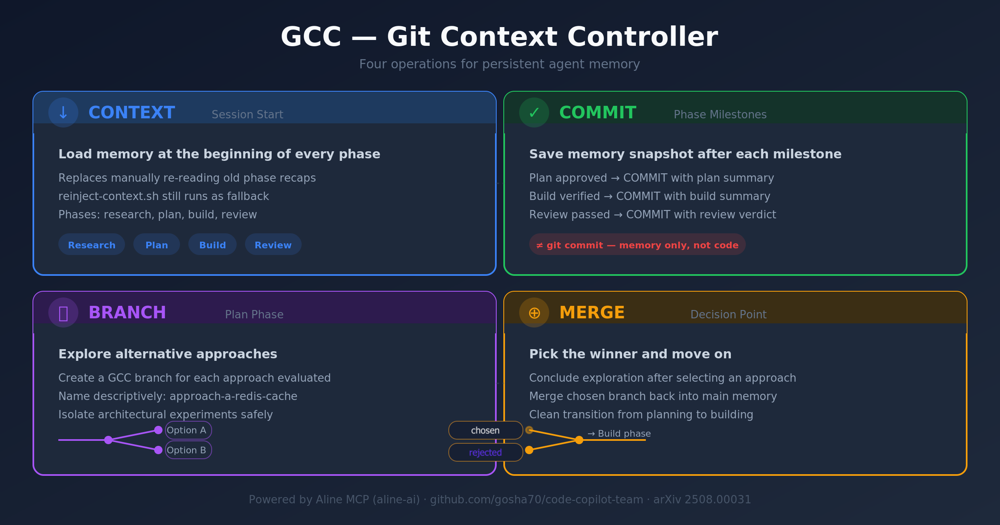

# Code Copilot Team

Reusable, opinionated configuration for AI-assisted coding with multi-agent team delegation. Ships with templates for ML/AI, Enterprise Java, and Web projects.

Built for **Claude Code** as the reference implementation, with portable conventions for Cursor, GitHub Copilot, Windsurf, Aider, and local LLMs.

> 📖 **Deep dive:** [Stop Fighting AI Agents and Build a Reusable Multi-Agent Dev Environment](https://www.linkedin.com/pulse/stop-fighting-ai-agents-build-reusable-multi-agent-dev-george-ivan-mxwbe) — the full story behind this project, lessons learned from 13+ real build sessions, and why every rule exists.

---

## Why This Exists

Every rule in this repo is failure-driven — it exists because we hit the specific failure it prevents, often more than once. After analyzing 13 sessions of a real project build, we identified six recurring patterns: dependency breaks, agents ignoring conventions, context window exhaustion, schema drift during parallel builds, agents not asking clarifying questions, and commit granularity issues. This setup prevents all of them.

## Framework Compliance

Evaluated against the two leading AI coding agent frameworks (February 2026):

### OpenAI Harness Engineering — 5.0 / 5.0



### Claude Code Best Practice — 10.0 / 10.0



> **Sources:** [OpenAI Harness Engineering](https://openai.com/index/harness-engineering/) · [Claude Code Best Practice](https://github.com/shanraisshan/claude-code-best-practice)

## Further Reading

- [Spec-Driven Development vs Code Copilot Team](docs/sdd-vs-code-copilot-team.md) — Side-by-side comparison with GitHub's Spec Kit. TL;DR: SDD defines *what* to build; Code Copilot Team defines *how to behave* while building it. They're complementary, not competing.


## What You Get



- **Layered rules** — 3 global rules (`~/.claude/rules/`) auto-load every session; 10 on-demand rules (`~/.claude/rules-library/`) loaded by phase agents when needed.
- **Phase agents** (`~/.claude/agents/`) — 4 phase agents (research, plan, build, review) plus 5 utility agents (code-simplifier, doc-writer, phase-recap, security-review, verify-app).
- **Hooks** (`~/.claude/hooks/`) — 6 lifecycle scripts: test verification, type checking, auto-format, file protection, context re-injection, and desktop notifications. Auto-detect your project's stack.
- **7 project templates** — pre-configured `CLAUDE.md` files with stack-specific conventions, slash commands, and agent team roles for each project archetype.
- **Four-phase workflow** — Research → Plan → Build → Review. Plus **Ralph Loop** for single-agent autonomous iteration.

- **Optional GCC memory** — persistent cross-session context via the [GCC protocol](https://arxiv.org/abs/2508.00031), powered by Aline MCP (`aline-ai`). Install with `--gcc`.

- **tmux launcher** (`claude-code`) — per-project sessions with git context display.

## Quick Start

```bash
# 1. Clone
git clone https://github.com/gosha70/code-copilot-team.git
cd code-copilot-team

# 2. Install for your tool(s)
./scripts/setup.sh --claude-code                    # Claude Code → ~/.claude/
./scripts/setup.sh --codex                          # OpenAI Codex → ~/.codex/
./scripts/setup.sh --cursor ~/my-project            # Cursor → project/.cursor/
./scripts/setup.sh --github-copilot ~/my-project    # GH Copilot → project/.github/
./scripts/setup.sh --windsurf ~/my-project          # Windsurf → project/.windsurf/
./scripts/setup.sh --aider ~/my-project             # Aider → project/CONVENTIONS.md

# Or install everything at once
./scripts/setup.sh --all ~/my-project

# (Optional) Enable GCC memory for Claude Code
./claude_code/claude-setup.sh --gcc

# Re-sync after pulling repo updates
git pull && ./scripts/setup.sh --sync --claude-code
```

The legacy `./claude_code/claude-setup.sh` path still works — it delegates to the adapter.

After `git pull`, run `--sync` to regenerate configs and re-install.

## Start a New Project

```bash
# Initialize from a template
claude-code init ml-rag ~/projects/my-rag-app

# Start a Claude session in the project
claude-code ~/projects/my-rag-app
```

## Start in an Existing Project

```bash
# Just point the launcher at it — global rules load automatically
claude-code ~/projects/existing-api
```

## Available Templates


| Template | Stack | Agent Team |
|---|---|---|
| `ml-rag` | Python · FAISS/Chroma · Neo4j/NetworkX | Team Lead, RAG Engineer, KG Engineer, Data Analyst, QA |
| `ml-langchain` | Python · LangChain/LangGraph/LangSmith | Team Lead, Agent Developer, Integration Engineer, QA & Eval |
| `ml-app` | Python · FastAPI · LiteLLM · Next.js/React | Team Lead, Backend Dev, Frontend Dev, ML/AI Engineer, QA |
| `ml-n8n` | Python · n8n · REST/webhooks | Team Lead, Workflow Designer, Python Developer, QA & DevOps |
| `java-enterprise` | Spring Boot · Kafka · GraphQL · React | Team Lead, Backend Dev, Frontend Dev, Data & Messaging, QA, DevOps |
| `web-static` | Astro/Next.js/Hugo · Tailwind | Team Lead, Frontend Dev, Content & SEO, QA |
| `web-dynamic` | Next.js/Remix · Node/Python · PostgreSQL | Team Lead, Frontend Dev, Backend Dev, QA, DevOps |

## How Configuration Layers Work

```
~/.claude/CLAUDE.md                ← Global agent manifest (base)
~/.claude/rules/*.md               ← Global rules (always loaded, 3 files)
  ├── coding-standards.md          SOLID, quality gates, prohibited patterns
  ├── copilot-conventions.md       Cross-tool portable conventions
  └── safety.md                    Destructive action guards, secrets policy
~/.claude/rules-library/*.md       ← On-demand rules (loaded by phase agents, 10 files)
  ├── agent-team-protocol.md       Three-phase workflow, delegation rules
  ├── clarification-protocol.md    Ask before implementing ambiguous requirements
  ├── environment-setup.md         Environment and config verification
  ├── integration-testing.md       Test integration points early
  ├── phase-workflow.md            Phase transition rules and boundaries
  ├── ralph-loop.md                Single-agent autonomous iteration loop
  ├── stack-constraints.md         Stack version and compatibility guards
  ├── team-lead-efficiency.md      Limit agents, poll frequency, no re-work
  ├── token-efficiency.md          Diff-over-rewrite, context economy
  └── gcc-protocol.md              GCC memory persistence (optional, Aline MCP)
~/.claude/agents/*.md              ← Phase + utility agents (9 files)
  ├── research.md                  Research phase agent
  ├── plan.md                      Plan phase agent
  ├── build.md                     Build phase agent
  ├── review.md                    Review phase agent
  ├── code-simplifier.md           Simplify recently changed code
  ├── doc-writer.md                Generate and update documentation
  ├── phase-recap.md               Summarize completed phase
  ├── security-review.md           Scan for security vulnerabilities
  └── verify-app.md                End-to-end project verification
~/.claude/hooks/*.sh               ← Deterministic lifecycle hooks (always active, 6 files)
  ├── verify-on-stop.sh            Run test suite when Claude finishes responding
  ├── verify-after-edit.sh         Run type checker after source file edits
  ├── auto-format.sh               Auto-format edited files
  ├── protect-files.sh             Prevent edits to protected files
  ├── reinject-context.sh          Re-inject session context on prompt submit
  └── notify.sh                    Desktop notifications (macOS + Linux)
~/.claude/settings.json            ← Hooks wiring and global settings
./CLAUDE.md                        ← Project-level (overrides global)
./.claude/commands/*.md            ← Project slash commands
./CLAUDE.local.md                  ← Personal overrides (gitignored)
```

Project-level rules override global rules. More specific always wins.

## Four-Phase Workflow

| Phase | Model | Effort | Delegation | What Happens |
|---|---|---|---|---|
| **Research** | Opus (highest) | High | None | Explore codebase, summarize findings, identify constraints |
| **Plan** | Opus (highest) | High | None | Design approach, get user approval |
| **Build** | Sonnet (fast) | Medium | Yes | Team Lead delegates to specialist sub-agents |
| **Build (loop)** | Sonnet (fast) | Medium | None | Ralph Loop: single agent iterates through stories autonomously |
| **Review** | Opus (highest) | High | None | Holistic review, run tests, verify consistency |

Each phase has a dedicated agent (`~/.claude/agents/`) that loads the relevant rules from the rules library. Planning and research must stay in one mind — sub-agents only see fragments and can't reason about the whole system. Delegation only happens during Build. For smaller features, **Ralph Loop** provides a single-agent alternative: read PRD → implement next failing story → test → commit → repeat.

## Supported Tools

All tools share the same rules from `shared/rules/always/`. Each adapter formats them for the target tool.

| Tool | Adapter Output | Install Location |
|---|---|---|
| **Claude Code** | agents, hooks, commands, settings | `~/.claude/` (global) |
| **OpenAI Codex** | `AGENTS.md` + 5 skills | `~/.codex/` (global) |
| **Cursor** | `.mdc` files with frontmatter | `project/.cursor/rules/` |
| **GitHub Copilot** | `copilot-instructions.md` + per-rule instructions | `project/.github/` |
| **Windsurf** | `rules.md` | `project/.windsurf/rules/` |
| **Aider** | `CONVENTIONS.md` | `project/` |

## Repo Structure

```
code-copilot-team/
├── shared/                              ← Single source of truth
│   ├── rules/always/                    3 global rules (always loaded)
│   ├── rules/on-demand/                 10 rules loaded by phase agents
│   ├── docs/                            6 tool-agnostic reference docs
│   └── templates/                       7 stacks × PROJECT.md + commands/
├── adapters/
│   ├── claude-code/                     agents, hooks, commands, settings, setup.sh
│   ├── codex/                           AGENTS.md, config.toml, 5 skills, setup.sh
│   ├── cursor/                          .cursor/rules/*.mdc, setup.sh
│   ├── github-copilot/                  .github/copilot-instructions.md, instructions/, setup.sh
│   ├── windsurf/                        .windsurf/rules/rules.md, setup.sh
│   └── aider/                           CONVENTIONS.md, setup.sh
├── scripts/
│   ├── generate.sh                      Builds adapter configs from shared/
│   └── setup.sh                         Unified install entry point
├── tests/
│   ├── test-hooks.sh                    59 hook tests
│   ├── test-generate.sh                 238 generation + adapter tests
│   └── test-shared-structure.sh         337 structure + content tests
├── claude_code/                         Backward-compat wrapper → adapters/claude-code/
├── .github/workflows/sync-check.yml     CI: adapter drift prevention
├── README.md
├── CONTRIBUTING.md
└── LICENSE
```

Rule content is written once in `shared/` and adapted per tool via `scripts/generate.sh`. Generated adapter configs are committed to the repo. CI verifies they never drift.

## Documentation

**Claude Code specific:**
- **[Setup Cookbook](adapters/claude-code/docs/claude-code-setup-cookbook.md)** — deep-dive into every configuration option
- **[Config Guide](adapters/claude-code/docs/claude-config-guide.md)** — templates, agent teams, output styles, and workflow reference
- **[Hooks Guide](adapters/claude-code/docs/hooks-guide.md)** — hook installation, customization, and supported stacks
- **[Sub-Agents Guide](adapters/claude-code/docs/subagents-guide.md)** — sub-agent configuration and usage
- **[Agent Traces](adapters/claude-code/docs/agent-traces.md)** — locating, reading, and archiving agent transcripts
- **[Debugging Strategies](adapters/claude-code/docs/debugging-strategies.md)** — /doctor, background tasks, Playwright MCP, trace debugging
- **[Permissions Guide](adapters/claude-code/docs/permissions-guide.md)** — per-stack Allow/Deny wildcard patterns for /permissions
- **[Recommended MCP Servers](adapters/claude-code/docs/recommended-mcp-servers.md)** — Context7, PostgreSQL, Filesystem, and Playwright MCP setup

**Shared (all tools):**
- **[Alignment Maintenance Checklist](shared/docs/alignment-maintenance.md)** — recurring governance checks to keep framework alignment healthy
- **[Common Pitfalls](shared/docs/common-pitfalls.md)** — cross-cutting issues and solutions
- **[Delegation Best Practices](shared/docs/delegation-best-practices.md)** — when and how to delegate to agents
- **[Ralph Loop Guide](shared/docs/ralph-loop-guide.md)** — Ralph Loop usage and configuration
- **[Session Management](shared/docs/session-management.md)** — session commands cheat sheet
- **[Error Reporting Template](shared/docs/error-reporting-template.md)** — standardized format for bug reports
- **[Phase Recap Template](shared/docs/phase-recap-template.md)** — end-of-phase handoff checklist

## Contributing

See [CONTRIBUTING.md](CONTRIBUTING.md). PRs welcome for new templates, rule improvements, and ports to other tools.

## Alignment Maintenance

Use the recurring checklist in [shared/docs/alignment-maintenance.md](shared/docs/alignment-maintenance.md) to keep this repo aligned as rules, skills, and templates evolve.

## License

[MIT](LICENSE)
