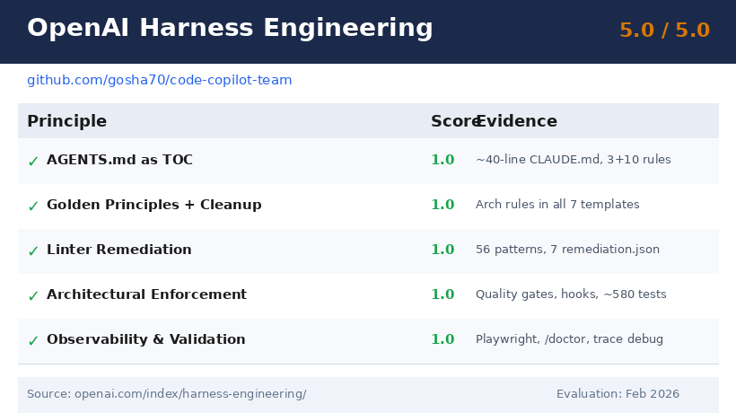
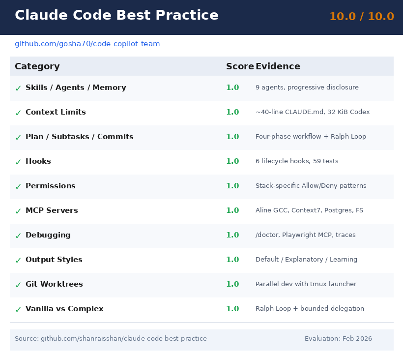
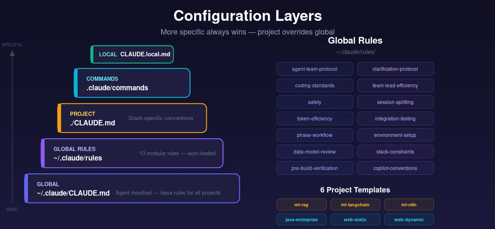
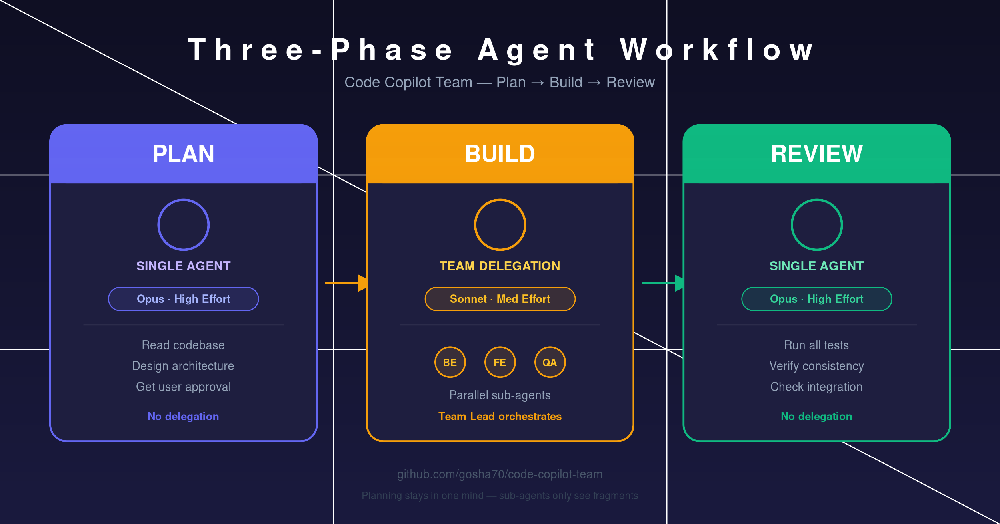
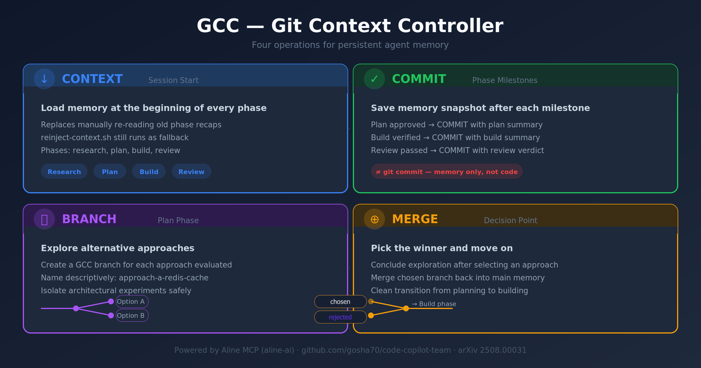
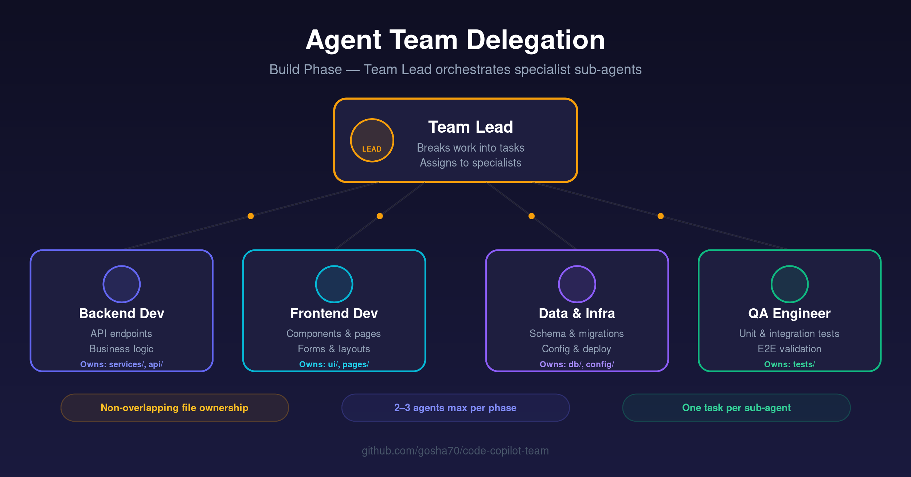

<h1>
  
  Code Copilot Team
</h1>


Reusable, opinionated configuration for AI-assisted coding with multi-agent team delegation. Ships with templates for ML/AI, Enterprise Java, and Web projects.

Built for **Claude Code** as the reference implementation, with portable conventions for Cursor, GitHub Copilot, Windsurf, Aider, and local LLMs.

> 📖 **Deep dive:** [Stop Fighting AI Agents and Build a Reusable Multi-Agent Dev Environment](https://www.linkedin.com/pulse/stop-fighting-ai-agents-build-reusable-multi-agent-dev-george-ivan-mxwbe) — the full story behind this project, lessons learned from 13+ real build sessions, and why every rule exists.

---

## Why This Exists

Every rule in this repo is failure-driven — it exists because we hit the specific failure it prevents, often more than once. After analyzing 13 sessions of a real project build, we identified six recurring patterns: dependency breaks, agents ignoring conventions, context window exhaustion, schema drift during parallel builds, agents not asking clarifying questions, and commit granularity issues. This setup prevents all of them.

## Framework Compliance

Evaluated against the two leading AI coding agent frameworks (February 2026):

### OpenAI Harness Engineering — 5.0 / 5.0



### Claude Code Best Practice — 10.0 / 10.0



> **Sources:** [OpenAI Harness Engineering](https://openai.com/index/harness-engineering/) · [Claude Code Best Practice](https://github.com/shanraisshan/claude-code-best-practice)

## Further Reading

- [Spec-Driven Development vs Code Copilot Team](docs/sdd-vs-code-copilot-team.md) — Side-by-side comparison with GitHub's Spec Kit. TL;DR: SDD defines *what* to build; Code Copilot Team defines *how to behave* while building it. They're complementary, not competing.


## Spec-Driven Development (SDD)

Code Copilot Team includes a built-in Spec-Driven Development layer that prevents "vibe coding" — the tendency of AI agents to start writing code before requirements are clear. SDD ensures every feature goes through a structured specification process, with the rigor scaled to match the risk.

### How It Works

Every task is classified into one of three **spec modes** based on risk:

| spec_mode | When | What's Required |
|---|---|---|
| **full** | Security, schema changes, integration, features touching >2 files | `plan.md` + `spec.md` + `tasks.md` |
| **lightweight** | Features touching 1–2 files, non-critical changes | `plan.md` + `spec.md` |
| **none** | Bug fixes (non-security), docs, trivial changes | `plan.md` only |

The Plan agent writes `plan.md` with a YAML frontmatter block that declares `spec_mode`, `feature_id`, `risk_category`, and `justification`. The Build agent reads this frontmatter and gates itself accordingly — it won't proceed on a `full` task without a complete `spec.md`, and it won't proceed on any task that has unresolved `[NEEDS CLARIFICATION]` markers.

### The Four Artifacts

SDD uses exactly four artifact types (no checklists, no extra process):

| Artifact | Purpose | When Created |
|---|---|---|
| `plan.md` | Implementation plan with frontmatter gating | Always (all modes) |
| `spec.md` | Requirements, user scenarios, constraints | `full` and `lightweight` only |
| `tasks.md` | Task breakdown with story and priority markers | `full` only |
| `lessons-learned.md` | Cross-project learnings for future sessions | End of project |

Templates for all four live in `shared/templates/sdd/` and are available across all adapters.

### Three-Layer Gating

SDD enforcement operates at three levels:

1. **Agent-level** — The Build agent reads `plan.md` frontmatter and conditionally requires `spec.md` and resolves `[NEEDS CLARIFICATION]` markers before proceeding.
2. **CI validation** — `scripts/validate-spec.sh` runs on every PR touching `specs/`. It validates frontmatter fields, checks for required files per spec_mode, and enforces justification for `spec_mode: none`.
3. **Hooks** — Existing hooks remain untouched; SDD gating is additive, not intrusive.

### Spec Artifacts Location

All SDD artifacts live in the versioned `specs/` directory, organized by feature:

```
specs/
└── <feature-id>/
    ├── plan.md              ← Always present
    ├── spec.md              ← full / lightweight
    ├── tasks.md             ← full only
    ├── lessons-learned.md   ← End of project
    └── collaboration/       ← Peer review artifacts (dual mode)
        ├── plan-consult.md  ← Peer review of plan phase
        └── build-review.md  ← Peer review of build phase
```

### Risk Classification

The `spec-workflow.md` rule defines risk categories that map directly to spec_mode:

| Risk Category | spec_mode | Examples |
|---|---|---|
| `security` | full | Auth changes, secrets handling, permission logic |
| `schema` | full | Database migrations, API contract changes |
| `integration` | full | Third-party integrations, cross-service changes |
| `feature` | full or lightweight | New features (full if >2 files, lightweight if 1–2) |
| `bug` | none | Non-security bug fixes |
| `docs` | none | Documentation-only changes |

### Adapter Support

SDD rules propagate through the same `shared/ → generate.sh → adapters/` pipeline as all other rules. Claude Code gets enforced gating via agent manifests. Other adapters receive advisory content appropriate to their capabilities:

| Adapter | SDD Support Level |
|---|---|
| Claude Code | **Enforced** — agents gate on frontmatter |
| GitHub Copilot | Full instructions (advisory) |
| Cursor, Windsurf | Always-on rules only (advisory) |
| Aider | Conventions only (advisory) |

### Getting Started with SDD

1. Start a Plan session — describe your feature to the Plan agent.
2. The Plan agent classifies risk, sets `spec_mode`, and writes the appropriate artifacts to `specs/<feature-id>/`.
3. Switch to Build — the Build agent reads the frontmatter and gates itself.
4. CI validates on PR — `validate-spec.sh` catches any missing artifacts or incomplete specs.

No additional setup required — SDD is active by default after installation.

## Peer Review (Multi-Copilot)

Code Copilot Team supports **dual-copilot peer review** — a second AI provider automatically reviews your work at phase completion. This catches blind spots that a single provider misses, using the same structured collaboration protocol regardless of which providers are involved.

### Prerequisites

1. **Install Code Copilot Team** — run `setup.sh --claude-code` (see [Quick Start](#quick-start)). This installs all peer review components:
   - `peer-review-runner.sh` and `providers-health.sh` to `~/.local/bin/`
   - `peer-review-on-stop.sh` hook to `~/.claude/hooks/`
   - `/phase-complete` command to `~/.claude/commands/`
   - Provider profile seed to `~/.code-copilot-team/providers.toml`

2. **Install the peer provider CLI** — the peer provider must be available on your machine. For example, to use OpenAI Codex as a peer reviewer, install the Codex CLI first.

3. **Verify provider availability:**
   ```bash
   providers-health.sh
   ```

### Setup — New Projects

```bash
# 1. Init project from template
claude-code init ml-rag ~/projects/my-app

# 2. Start session with peer review
claude-code --peer-review codex ~/projects/my-app
```

### Setup — Existing Projects

No project-level changes required. Peer review is driven entirely by session flags and global hooks:

```bash
# Just add --peer-review to your usual launch command
claude-code --peer-review codex ~/projects/existing-app

# Or use the default peer from your provider profile
cd ~/projects/existing-app && claude-code --peer-review
```

### How It Works

1. **Start a session with peer review enabled:**
   ```bash
   claude-code --peer-review codex ~/projects/my-app   # explicit peer provider
   claude-code --peer-review ~/projects/my-app          # default peer from profile
   claude-code --peer-review-off ~/projects/my-app      # disable for this session
   claude-code --peer-review-scope code ~/projects/my-app  # scope: code|design|both
   ```

2. **Work normally** through the Plan → Build phases. Claude detects `CCT_PEER_REVIEW_ENABLED=true` in the environment and sets `collaboration_mode: dual` in the SDD plan.

3. **Run `/phase-complete`** when a phase is done — this creates the review marker (`.cct/review/pending.json`). The phase-workflow rules instruct Claude to run this command at phase boundaries when peer review is active, but you can also run it manually at any time.

4. **Peer review executes on stop** — when Claude stops responding, the `peer-review-on-stop.sh` hook detects the marker, invokes the peer provider via `peer-review-runner.sh`, and writes a collaboration artifact to `specs/<feature-id>/collaboration/`.

5. **Review the artifact** — the collaboration artifact contains the peer's findings with a verdict (`PASS`, `FAIL`, `INCONCLUSIVE`) and structured feedback.

### Provider Profile

Peer providers are configured in `~/.code-copilot-team/providers.toml` (seeded by setup):

```toml
[defaults]
peer_for.claude = "codex"
peer_for.codex = "claude"

[providers.codex]
command = "codex --quiet --prompt-file {review_request}"
timeout_sec = 300
healthcheck = "codex --version"

[providers.ollama]
command = "ollama run {model} < {review_request}"
timeout_sec = 600
healthcheck = "ollama --version"
model = "llama3"
```

Add your own providers by creating new `[providers.<name>]` sections. The `{review_request}` placeholder is replaced with the path to a temporary file containing the review prompt.

### Safety Model

- **Fail-closed** — if the peer review runner fails, the session blocks (exit 2). This prevents unreviewed work from proceeding silently.
- **Escape hatch** — set `CCT_PEER_BYPASS=true` to skip a stuck review. CI rejects bypass artifacts.
- **Staleness check** — markers from previous sessions are ignored (compared via `requested_at` vs `CCT_SESSION_START`).
- **Identity tracking** — collaboration artifacts include `peer_profile` (provider name) and `runner_fingerprint` (SHA-256 of command template) for auditability.

### Collaboration Modes

| Mode | When | What Happens |
|---|---|---|
| **single** (default) | No `--peer-review` flag | Standard single-provider workflow, no peer review |
| **dual** | `--peer-review [provider]` | Peer reviews at `/phase-complete`, artifacts written to `specs/` |

## What You Get



- **Layered rules** — 3 global rules (`~/.claude/rules/`) auto-load every session; 13 on-demand rules (`~/.claude/rules-library/`) loaded by phase agents when needed.
- **Phase agents** (`~/.claude/agents/`) — 4 phase agents (research, plan, build, review) plus 5 utility agents (code-simplifier, doc-writer, phase-recap, security-review, verify-app).
- **Hooks** (`~/.claude/hooks/`) — 7 lifecycle scripts: test verification, type checking, auto-format, file protection, context re-injection, peer review trigger, and desktop notifications. Auto-detect your project's stack.
- **8 project templates** — pre-configured `CLAUDE.md` files with stack-specific conventions, slash commands, and agent team roles for each project archetype.
- **Four-phase workflow** — Research → Plan → Build → Review. Plus **Ralph Loop** for single-agent autonomous iteration.

- **Optional GCC memory** — persistent cross-session context via the [GCC protocol](https://arxiv.org/abs/2508.00031), powered by Aline MCP (`aline-ai`). Install with `--gcc`.

- **tmux launcher** (`claude-code`) — per-project sessions with git context display and `--peer-review` flags.

## Quick Start

```bash
# 1. Clone
git clone https://github.com/gosha70/code-copilot-team.git
cd code-copilot-team

# 2. Install for your tool(s)
./scripts/setup.sh --claude-code                    # Claude Code → ~/.claude/
./scripts/setup.sh --codex                          # OpenAI Codex → ~/.codex/
./scripts/setup.sh --cursor ~/my-project            # Cursor → project/.cursor/
./scripts/setup.sh --github-copilot ~/my-project    # GH Copilot → project/.github/
./scripts/setup.sh --windsurf ~/my-project          # Windsurf → project/.windsurf/
./scripts/setup.sh --aider ~/my-project             # Aider → project/CONVENTIONS.md

# Or install everything at once
./scripts/setup.sh --all ~/my-project

# (Optional) Enable GCC memory for Claude Code
./claude_code/claude-setup.sh --gcc

# Re-sync after pulling repo updates
git pull && ./scripts/setup.sh --sync --claude-code
```

The legacy `./claude_code/claude-setup.sh` path still works — it delegates to the adapter.

After `git pull`, run `--sync` to regenerate configs and re-install.

## Start a New Project

```bash
# Initialize from a template
claude-code init ml-rag ~/projects/my-rag-app

# Start a Claude session in the project
claude-code ~/projects/my-rag-app
```

## Start in an Existing Project

```bash
# Just point the launcher at it — global rules load automatically
claude-code ~/projects/existing-api
```

## Available Templates



| Template | Stack | Agent Team |
|---|---|---|
| `ml-rag` | Python · FAISS/Chroma · Neo4j/NetworkX | Team Lead, RAG Engineer, KG Engineer, Data Analyst, QA |
| `ml-langchain` | Python · LangChain/LangGraph/LangSmith | Team Lead, Agent Developer, Integration Engineer, QA & Eval |
| `ml-app` | Python · FastAPI · LiteLLM · Next.js/React | Team Lead, Backend Dev, Frontend Dev, ML/AI Engineer, QA |
| `ml-n8n` | Python · n8n · REST/webhooks | Team Lead, Workflow Designer, Python Developer, QA & DevOps |
| `java-enterprise` | Spring Boot · Kafka · GraphQL · React | Team Lead, Backend Dev, Frontend Dev, Data & Messaging, QA, DevOps |
| `web-static` | Astro/Next.js/Hugo · Tailwind | Team Lead, Frontend Dev, Content & SEO, QA |
| `web-dynamic` | Next.js/Remix · Node/Python · PostgreSQL | Team Lead, Frontend Dev, Backend Dev, QA, DevOps |
| `java-tooling` | Java 21 · Gradle · JSR 269 · JavaPoet · Spring AI MCP | Team Lead, APT Engineer, MCP Specialist, Plugin Dev, QA |

## How Configuration Layers Work

```
~/.claude/CLAUDE.md                ← Global agent manifest (base)
~/.claude/rules/*.md               ← Global rules (always loaded, 3 files)
  ├── coding-standards.md          SOLID, quality gates, prohibited patterns
  ├── copilot-conventions.md       Cross-tool portable conventions
  └── safety.md                    Destructive action guards, secrets policy
~/.claude/rules-library/*.md       ← On-demand rules (loaded by phase agents, 13 files)
  ├── agent-team-protocol.md       Three-phase workflow, delegation rules
  ├── clarification-protocol.md    Ask before implementing ambiguous requirements
  ├── environment-setup.md         Environment and config verification
  ├── integration-testing.md       Test integration points early
  ├── phase-workflow.md            Phase transition rules and boundaries
  ├── provider-collaboration-protocol.md  Peer review protocol and collaboration rules
  ├── ralph-loop.md                Single-agent autonomous iteration loop
  ├── spec-workflow.md             SDD spec gating and artifact management
  ├── stack-constraints.md         Stack version and compatibility guards
  ├── team-lead-efficiency.md      Limit agents, poll frequency, no re-work
  ├── token-efficiency.md          Diff-over-rewrite, context economy
  ├── gcc-protocol.md              GCC memory persistence (optional, Aline MCP)
  └── infra-verification.md        Infrastructure artifact verification ("build it, run it")
~/.claude/agents/*.md              ← Phase + utility agents (9 files)
  ├── research.md                  Research phase agent
  ├── plan.md                      Plan phase agent
  ├── build.md                     Build phase agent
  ├── review.md                    Review phase agent
  ├── code-simplifier.md           Simplify recently changed code
  ├── doc-writer.md                Generate and update documentation
  ├── phase-recap.md               Summarize completed phase
  ├── security-review.md           Scan for security vulnerabilities
  └── verify-app.md                End-to-end project verification
~/.claude/hooks/*.sh               ← Deterministic lifecycle hooks (always active, 7 files)
  ├── verify-on-stop.sh            Run test suite when Claude finishes responding
  ├── verify-after-edit.sh         Run type checker after source file edits
  ├── auto-format.sh               Auto-format edited files
  ├── protect-files.sh             Prevent edits to protected files
  ├── peer-review-on-stop.sh       Trigger peer review on phase completion
  ├── reinject-context.sh          Re-inject session context on prompt submit
  └── notify.sh                    Desktop notifications (macOS + Linux)
~/.claude/settings.json            ← Hooks wiring and global settings
./CLAUDE.md                        ← Project-level (overrides global)
./.claude/commands/*.md            ← Project slash commands
./CLAUDE.local.md                  ← Personal overrides (gitignored)
```

Project-level rules override global rules. More specific always wins.

## Four-Phase Workflow

| Phase | Model | Effort | Delegation | What Happens |
|---|---|---|---|---|
| **Research** | Opus (highest) | High | None | Explore codebase, summarize findings, identify constraints |
| **Plan** | Opus (highest) | High | None | Design approach, get user approval |
| **Build** | Sonnet (fast) | Medium | Yes | Team Lead delegates to specialist sub-agents |
| **Build (loop)** | Sonnet (fast) | Medium | None | Ralph Loop: single agent iterates through stories autonomously |
| **Review** | Opus (highest) | High | None | Holistic review, run tests, verify consistency |

Each phase has a dedicated agent (`~/.claude/agents/`) that loads the relevant rules from the rules library. Planning and research must stay in one mind — sub-agents only see fragments and can't reason about the whole system. Delegation only happens during Build. For smaller features, **Ralph Loop** provides a single-agent alternative: read PRD → implement next failing story → test → commit → repeat.

## Supported Tools

All tools share the same rules from `shared/rules/always/`. Each adapter formats them for the target tool.

| Tool | Adapter Output | Install Location |
|---|---|---|
| **Claude Code** | agents, hooks, commands, settings | `~/.claude/` (global) |
| **OpenAI Codex** | `AGENTS.md` + 5 skills | `~/.codex/` (global) |
| **Cursor** | `.mdc` files with frontmatter | `project/.cursor/rules/` |
| **GitHub Copilot** | `copilot-instructions.md` + per-rule instructions | `project/.github/` |
| **Windsurf** | `rules.md` | `project/.windsurf/rules/` |
| **Aider** | `CONVENTIONS.md` | `project/` |

## Repo Structure

```
code-copilot-team/
├── shared/                              ← Single source of truth
│   ├── rules/always/                    3 global rules (always loaded)
│   ├── rules/on-demand/                 13 rules loaded by phase agents
│   ├── docs/                            7 tool-agnostic reference docs
│   ├── templates/                       8 stacks × PROJECT.md + commands/
│   ├── templates/sdd/                   5 SDD templates (spec, plan, tasks, lessons-learned, collaboration)
│   └── templates/provider-profile-template.toml  Peer provider profile seed
├── specs/                               ← SDD artifacts per feature (versioned)
│   └── <feature-id>/                    plan.md, spec.md, tasks.md, lessons-learned.md
├── adapters/
│   ├── claude-code/                     agents, hooks, commands, settings, setup.sh
│   ├── codex/                           AGENTS.md, config.toml, 5 skills, setup.sh
│   ├── cursor/                          .cursor/rules/*.mdc, setup.sh
│   ├── github-copilot/                  .github/copilot-instructions.md, instructions/, setup.sh
│   ├── windsurf/                        .windsurf/rules/rules.md, setup.sh
│   └── aider/                           CONVENTIONS.md, setup.sh
├── scripts/
│   ├── generate.sh                      Builds adapter configs from shared/
│   ├── validate-spec.sh                 SDD spec validator (CI + local)
│   ├── peer-review-runner.sh            Peer review execution engine
│   ├── providers-health.sh              Peer provider availability diagnostics
│   └── setup.sh                         Unified install entry point
├── tests/
│   ├── test-hooks.sh                    85 hook tests
│   ├── test-generate.sh                 261 generation + adapter tests
│   └── test-shared-structure.sh         601 structure + content tests
├── claude_code/                         Backward-compat wrapper → adapters/claude-code/
├── .github/workflows/sync-check.yml     CI: adapter drift + full gate verification
├── README.md
├── CONTRIBUTING.md
└── LICENSE
```

Rule content is written once in `shared/` and adapted per tool via `scripts/generate.sh`. Generated adapter configs are committed to the repo. CI verifies they never drift.

## Documentation

**Claude Code specific:**
- **[Setup Cookbook](adapters/claude-code/docs/claude-code-setup-cookbook.md)** — deep-dive into every configuration option
- **[Config Guide](adapters/claude-code/docs/claude-config-guide.md)** — templates, agent teams, output styles, and workflow reference
- **[Hooks Guide](adapters/claude-code/docs/hooks-guide.md)** — hook installation, customization, and supported stacks
- **[Sub-Agents Guide](adapters/claude-code/docs/subagents-guide.md)** — sub-agent configuration and usage
- **[Agent Traces](adapters/claude-code/docs/agent-traces.md)** — locating, reading, and archiving agent transcripts
- **[Debugging Strategies](adapters/claude-code/docs/debugging-strategies.md)** — /doctor, background tasks, Playwright MCP, trace debugging
- **[Permissions Guide](adapters/claude-code/docs/permissions-guide.md)** — per-stack Allow/Deny wildcard patterns for /permissions
- **[Recommended MCP Servers](adapters/claude-code/docs/recommended-mcp-servers.md)** — Context7, PostgreSQL, Filesystem, and Playwright MCP setup

**Shared (all tools):**
- **[Alignment Maintenance Checklist](shared/docs/alignment-maintenance.md)** — recurring governance checks to keep framework alignment healthy
- **[Common Pitfalls](shared/docs/common-pitfalls.md)** — cross-cutting issues and solutions
- **[Delegation Best Practices](shared/docs/delegation-best-practices.md)** — when and how to delegate to agents
- **[Ralph Loop Guide](shared/docs/ralph-loop-guide.md)** — Ralph Loop usage and configuration
- **[Session Management](shared/docs/session-management.md)** — session commands cheat sheet
- **[Error Reporting Template](shared/docs/error-reporting-template.md)** — standardized format for bug reports
- **[Phase Recap Template](shared/docs/phase-recap-template.md)** — end-of-phase handoff checklist

## Contributing

See [CONTRIBUTING.md](CONTRIBUTING.md). PRs welcome for new templates, rule improvements, and ports to other tools.

## Community Standards

- [Code of Conduct](CODE_OF_CONDUCT.md)
- [Code Owners](.github/CODEOWNERS)
- [Security Policy](SECURITY.md)
- [Issue Templates](.github/ISSUE_TEMPLATE/)
- [Pull Request Template](.github/pull_request_template.md)
- [GitHub Hardening Playbook](docs/github-hardening-playbook.md)

## Alignment Maintenance

Use the recurring checklist in [shared/docs/alignment-maintenance.md](shared/docs/alignment-maintenance.md) to keep this repo aligned as rules, skills, and templates evolve.

## License

[MIT](LICENSE)
