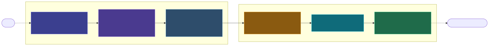

<h1>
  
  Code Copilot Team
</h1>


Reusable, opinionated configuration for AI-assisted coding with multi-agent team delegation. Ships with templates for ML/AI, Enterprise Java, and Web projects.

Built for **Claude Code** as the reference implementation, with the provider-neutral **Pi** enforced harness and portable conventions for Cursor, GitHub Copilot, Windsurf, Aider, and local LLMs.

[](https://github.com/gosha70/code-copilot-team/releases)
[](https://github.com/gosha70/code-copilot-team/actions/workflows/sync-check.yml)
[](https://github.com/gosha70/code-copilot-team/actions/workflows/pi-tests.yml)

> 📖 **Deep dive:** [Stop Fighting AI Agents and Build a Reusable Multi-Agent Dev Environment](https://www.linkedin.com/pulse/stop-fighting-ai-agents-build-reusable-multi-agent-dev-george-ivan-mxwbe) — the full story behind this project, lessons learned from 13+ real build sessions, and why every rule exists.

---

## Quick Start

Get running in about 5 minutes:

```bash
# 1. Clone the latest stable release (master is unreleased, in-development)
git clone --branch v1.1.0 https://github.com/gosha70/code-copilot-team.git
cd code-copilot-team

# 2. Install for your AI tool (two first-class harnesses — all tools listed below)
./scripts/setup.sh --claude-code    # Claude Code → ~/.claude/
./scripts/setup.sh --pi             # Pi (enforced, provider-neutral) → ~/.code-copilot-team/pi/

# 3. Discover what you just installed
./scripts/cct list          # every feature, slash command, skill, and capability
```

**Discover the features:** browse the generated **[Feature Index](docs/features.md)** —
every feature (with maturity and adapter support), slash command, skill, and capability in one place — or run `scripts/cct list`
anytime. More install targets (Cursor, Codex, Copilot, Windsurf, Aider, and the
Claude Code plugin) are under [Install options](#install-options-all-tools).

New to the ideas behind it? See [Why this exists](#why-this-exists),
[Spec-Driven Development](#spec-driven-development-sdd), and the
[Documentation](#documentation) index.

## Why This Exists

Every rule in this repo is failure-driven — it exists because we hit the specific failure it prevents, often more than once. After analyzing 13 sessions of a real project build, we identified six recurring patterns: dependency breaks, agents ignoring conventions, context window exhaustion, schema drift during parallel builds, agents not asking clarifying questions, and commit granularity issues. Every rule and gate here exists to catch one of those patterns before it lands.

External reviews, scorecards, and the sources that shaped this harness are collected in [Evidence & Influences](docs/evidence-and-influences.md).

## Further Reading

- [Spec-Driven Development vs Code Copilot Team](docs/sdd-vs-code-copilot-team.md) — Side-by-side comparison with GitHub's Spec Kit. TL;DR: SDD defines *what* to build; Code Copilot Team defines *how to behave* while building it. They're complementary, not competing.


## Spec-Driven Development (SDD)

A feature is specified, planned and task-listed in `specs/<feature-id>/` before code is written, with an origin-alignment gate that stops a build that has drifted. See **[Spec-driven development](docs/spec-driven-development.md)**.

## Shape-Up (Product Bets)

SDD answers *"how do we know we built the right thing?"* — Shape-Up answers *"what do we build next, and how big should it be?"* The two are complementary: a pitch describes the *bet*, SDD's plan/spec/tasks describe the *implementation* underneath one or more scopes of that pitch.

Code Copilot Team ships a local-first Shape-Up implementation: pitches and hill charts as plain files under `specs/pitches/<id>/`, four agents (`pitch-shaper`, `scope-executor`, `cycle-retro`, `cooldown-report`), five slash commands (`/shape`, `/bet`, `/cycle-start`, `/hill`, `/cooldown`), and `validate-pitch.sh` enforcing frontmatter (appetite ∈ `{2w, 4w, 6w}`, bet_status lifecycle, cycle/circuit-breaker conditional rules) on every PR.

Use Shape-Up for product-shaped work — greenfield, ambiguous problem space, multiple possible solutions, time-boxed bets. Use SDD alone for feature-shaped work where the requirement is clear.

📖 **Full guide:** [docs/shape-up-workflow.md](docs/shape-up-workflow.md) — methodology, frontmatter schema, lifecycle diagram, agent reference, install surface, and a worked example.

## Peer Review (Multi-Copilot)

A second provider reviews your diff in a read-only sandbox and answers PASS, FAIL or INCONCLUSIVE. **[Peer review](docs/peer-review.md)** explains the mechanism; the **[setup cookbook](docs/auto-code-review-setup.md)** is the ordered path to a working reviewer.

## LLM Wiki Maintainer

`code-copilot-team` ships a Karpathy-pattern LLM Wiki maintainer that
turns `knowledge/raw/` into a curated, cited, agent-readable markdown
layer under `knowledge/wiki/`. Five operations, one CLI:

```bash
./scripts/wiki ingest <source>          # multi-page write plan against existing wiki state
./scripts/wiki promote <proposal-dir>   # atomic apply (only writer to the canonical wiki content tree, excluding .audit/)
./scripts/wiki query "<question>"       # index-first synthesis with citations
./scripts/wiki query --file-back "..."  # round-trip the answer back into a patch-set
./scripts/wiki lint                     # structural lint (frontmatter, links, slugs)
./scripts/wiki lint --health [--strict] # knowledge-health (contradictions, stale claims, weak orphans, missing cross-links)
./scripts/wiki audit-flush              # commit pending ingest-log lines (reject-only durability)
./scripts/wiki audit-flush --dry-run    # report count + blob SHA without committing
```

**Human approval is always gating, and the source-control boundary
is explicit: the wiki is source-controlled, the proposal workspace
is not.** `wiki ingest` writes draft proposals to a local-only
`doc_internal/proposals/` directory (gitignored — proposals are
working drafts, not canonical state). `wiki promote` is the only
operation that writes to the canonical `knowledge/wiki/` content tree;
`wiki ingest` has one additional tracked write: appending to the
append-only `knowledge/wiki/.audit/ingest-log.md` audit ledger. The
audit trail under `knowledge/wiki/.audit/` records every `wiki ingest`
decision (timestamp, source SHA, backend, disposition, reason) in
`ingest-log.md`, and every accepted proposal's original LLM draft in
`knowledge/wiki/.audit/proposals/<date>-<slug>/` (applied atomically
by `wiki promote`). `wiki audit-flush` (shipped in
[gosha70/code-copilot-team#37](https://github.com/gosha70/code-copilot-team/issues/37))
closes the reject-only durability gap: run it after a reject-only session
to commit any pending audit lines in a focused `audit: flush N pending
ingest-log line(s)` commit. Promotion
history is traceable via git on `knowledge/wiki/` plus
`knowledge/wiki/log.md`.

The CLI auto-detects an installed copilot backend in the order
`claude → codex → cursor`. Override with `--backend <name>` or
`WIKI_INGEST_BACKEND=<name>`. Use `--backend test` for the
deterministic stub backend (no LLM call; this is what CI uses).

For the v1 single-source flow, the legacy invocation
`./scripts/wiki-ingest <source>` is preserved as a backwards-compat
alias.

### Operator docs

- Full operator workflow: [`knowledge/README.md`](knowledge/README.md) §5e.
- Workflow page: [`knowledge/wiki/workflows/run-wiki-ingest.md`](knowledge/wiki/workflows/run-wiki-ingest.md).
- Design rationale: [`specs/wiki-ingest-pipeline/spec.md`](specs/wiki-ingest-pipeline/spec.md).
- Schema: [`knowledge/wiki/schema/`](knowledge/wiki/schema/) — page types, ingest rules, citation rules, lint rules, curator persona.

## Benchmark Harness

`code-copilot-team` ships a benchmark-agnostic harness for evaluating AI
copilots and LLMs on real coding tasks under reproducible isolation —
so you can answer "which copilot/model is actually better on this kind
of work?" with a controlled run record instead of a vibe.

It does **not** author benchmarks; it runs established public ones
(Aider Polyglot, SWE-bench Verified, BigCodeBench) and custom CCT
fixtures through one adapter contract. There are two entry points — a
terse daily-driver wrapper and the underlying harness CLI:

```bash
# Daily driver — safe by default (no-arg run is a free stub smoke + env detection)
./scripts/bench                                          # prove the plumbing, no LLM call, no spend
./scripts/bench sonnet ollama:qwen2.5-coder:7b           # compare two models on a coding task
./scripts/bench --preset local-vs-cloud --runs 5         # curated comparison preset
./scripts/bench --list-presets                           # discovery: available presets
./scripts/bench --list-providers                         # discovery: detected backends/providers

# Underlying harness
./scripts/benchmark list                                 # adapters + backends + judges
./scripts/benchmark run --benchmark aider-polyglot \
    --backend claude-code --model sonnet --runs 3        # one (backend, model) run
./scripts/benchmark compare --config my-compare.json     # multi-LLM comparison
./scripts/benchmark report --run-dir runs/<ts>/ --html --csv  # rich report (HTML + SVG charts + CSV)
```

**What it measures.** Deterministic scoring is the primary signal —
build/test/lint pass, required files present, elapsed time, token usage
— with a calibrated winner-declaration rule (`Δ > 2σ AND ≥ threshold`)
that refuses to call a winner on noise. A **calibrated LLM judge**
(issue #34) adds a secondary quality signal (idiomaticity, error
handling, test thoughtfulness, security hygiene), but only after it's
proven to correlate with human reviewers (Spearman ρ ≥ threshold per
dimension); it never overrides the deterministic verdict, and a run
that fails its tests can never win on judge-only criteria. No
dollar-cost estimates are ever reported.

**Backends** (the agent driving the task): `claude-code`, `codex`,
`aider`, plus a deterministic `stub` for CI. Local models (vLLM,
Ollama, LM Studio) are reached as *providers* through the gateway env
vars — `./scripts/bench sonnet vllm:<model>@<endpoint>` probes the
endpoint and spawns an ephemeral Anthropic↔OpenAI proxy when needed.

### Operator docs

- Full harness guide, CLI reference, adapter/backend/judge contracts: [`benchmarks/README.md`](benchmarks/README.md).
- 60-second quickstart: [`benchmarks/README.md` § 60-second quickstart](benchmarks/README.md#60-second-quickstart).
- Routing-quality evaluation (measuring CCT's router against control arms, #109 E1): [`benchmarks/README.md` § Routing-quality evaluation](benchmarks/README.md#routing-quality-evaluation-e1-of-109-issue-260).
- Shadow-mode routing analysis (consuming E1 evidence sets through session analytics + Studio, #109 E2): [`scripts/session_analytics/README.md` § Routing evidence](scripts/session_analytics/README.md#routing-evidence--shadow-mode-e2-of-109-issue-261).
- Calibration gates + shadow kNN (the #109 §12 promotion conditions made executable, #109 E3): [`scripts/session_analytics/README.md` § Calibration gates](scripts/session_analytics/README.md#calibration-gates--shadow-knn-e3-of-109-issue-266).
- Design rationale: [`specs/benchmark-harness/spec.md`](specs/benchmark-harness/spec.md) and the per-feature spec bundles under [`specs/`](specs/).

## UI Design Harness

Stops copilot-generated UI from converging on the generic "AI-slop" look (default fonts, purple gradients, centered cards, `<div onClick>` a11y) and gates it with a closed visual-review loop. Two on-demand skills + a shippable, tool-agnostic runner.

- **Steering bundle** — every UI project commits `DESIGN.md` + `design/tokens.json` (DTCG). The `design-system` skill derives a domain-fit direction (brand archetype + user + density) and overrides the framework defaults (neutral, accent, font, radius) so output is bespoke by construction, not generic.
- **Visual-review loop** — `npm run copilot:review` boots the app, runs an axe-core WCAG 2.2 AA gate + an anti-slop rubric, screenshots at 375/768/1440, and a critic scores against `DESIGN.md`: the `visual-reviewer` agent on Claude Code (reads the PNGs), or a vision LLM over `fetch` for other tools. Iterates to a quality bar (cap 3); degrades to an HTTP smoke when Playwright is absent (a dead dev server still fails).
- **Enable it** — the `web-dynamic` / `web-static` templates reference it. Scaffold into any project from `~/.claude/templates/ui-harness/` (`harness/`, `DESIGN.md`, `design/`), then add `"copilot:review": "cd harness && npm run harness:verify"` to `package.json`.

Skills: `design-system`, `visual-review` · Agent: `visual-reviewer` · Template: `ui-harness`.

## What You Get



- **Layered rules** — 4 global rules (`~/.claude/rules/`) auto-load every session; 20 on-demand skills (`~/.claude/skills/*/SKILL.md`) loaded by phase agents when needed.
- **Phase agents** (`~/.claude/agents/`) — 4 phase agents (research, plan, build, review) plus 10 utility agents (code-simplifier, cooldown-report, cycle-retro, doc-writer, phase-recap, pitch-shaper, scope-executor, security-review, verify-app, visual-reviewer).
- **Hooks** (`~/.claude/hooks/`) — 11 lifecycle scripts: test verification, type checking, auto-format, file protection, git safety guards, context re-injection, peer review trigger, desktop notifications, plus 3 self-guarding MemKernel hooks (session recall, pre-compact checkpoint, post-compact recovery) that activate only when MemKernel is installed.
- **11 project templates** — pre-configured `CLAUDE.md` files with stack-specific conventions, slash commands, and agent team roles for each project archetype.
- **Four-phase workflow** — Research → Plan → Build → Review. Plus **Ralph Loop** for single-agent autonomous iteration.

- **Adaptive launcher** (`claude-code`) — uses `cmux` on macOS, `tmux` elsewhere, with git context display, `--peer-review` flags, and `sync` for keeping projects aligned with template updates.

## Install options (all tools)

```bash
# 1. Clone the latest stable release (drop --branch for unreleased master)
git clone --branch v1.1.0 https://github.com/gosha70/code-copilot-team.git
cd code-copilot-team

# 2. Install for your tool(s)
./scripts/setup.sh --claude-code                    # Claude Code → ~/.claude/
./scripts/setup.sh --pi                             # Pi (enforced) → ~/.code-copilot-team/pi/
./scripts/setup.sh --codex                          # OpenAI Codex → ~/.codex/
./scripts/setup.sh --cursor ~/my-project            # Cursor → project/.cursor/
./scripts/setup.sh --github-copilot ~/my-project    # GH Copilot → project/.github/
./scripts/setup.sh --windsurf ~/my-project          # Windsurf → project/.windsurf/
./scripts/setup.sh --aider ~/my-project             # Aider → project/CONVENTIONS.md

# Or install everything at once
./scripts/setup.sh --all ~/my-project

# Re-sync after pulling repo updates
git pull && ./scripts/setup.sh --sync --claude-code
```

The legacy `./claude_code/claude-setup.sh` path still works — it delegates to the adapter.

After `git pull`, run `--sync` to regenerate configs and re-install.

### Alternative: Install as a Claude Code Plugin

For Claude Code users who prefer the plugin system over `setup.sh`:

```bash
# Add the CCT marketplace (one-time)
/plugin marketplace add gosha70/code-copilot-team

# Install the hooks plugin
/plugin install code-copilot-team@code-copilot-team
```

This installs the same hooks (file protection, auto-format, type verification, context re-injection, git safety, notifications) as `setup.sh`, but managed through Claude Code's plugin system. Update installed plugins with `/plugin marketplace update`. The plugin does not include peer-review or memkernel hooks — those are CCT-pipeline-specific and remain in the `setup.sh` path.

Both install paths coexist. Use `setup.sh` for the full install (skills, agents, templates, hooks, peer review) or the plugin for hooks only.

### Recommended: Install LSP Plugins (Claude Code)

For continuous type-error feedback during edits, install the appropriate code-intelligence plugin. Each requires its language-server binary on `$PATH`:

```bash
# Install the language server first, then the plugin:
pip install pyright && /plugin install pyright-lsp@claude-plugins-official           # Python
npm i -g typescript-language-server typescript && /plugin install typescript-lsp@claude-plugins-official  # TypeScript
go install golang.org/x/tools/gopls@latest && /plugin install gopls-lsp@claude-plugins-official  # Go
```

These provide native LSP diagnostics and are preferred over the bundled `verify-after-edit.sh` hook. The hook remains as a fallback for languages without an LSP plugin. See the [official plugin catalog](https://claude.com/plugins) for all available languages.

## Start a New Project

```bash
# Initialize from a template
claude-code init ml-rag ~/projects/my-rag-app

# Start a Claude session in the project
claude-code ~/projects/my-rag-app
```

## Start in an Existing Project

```bash
# Just point the launcher at it — global rules load automatically
claude-code ~/projects/existing-api
```

## Sync a Project to Latest Template

After pulling repo updates, sync your project's commands and `.claude/` files against the latest template:

```bash
# 1. Update global config + templates from repo
git pull && ./scripts/setup.sh --sync --claude-code

# 2. Preview what would change (safe — no files modified)
claude-code sync ~/projects/my-rag-app --dry-run

# 3. Apply the sync
claude-code sync ~/projects/my-rag-app
```

Sync updates commands and `.claude/` contents (e.g. `remediation.json`) but never overwrites your `CLAUDE.md` — it shows a diff for manual review instead. Projects initialized with `claude-code init` have a `.claude/template.json` that tracks the template; older projects are matched by their `CLAUDE.md` heading.

## Available Templates

Eleven stack templates, each with an agent team, slash commands and a CI workflow. See **[Project templates](docs/project-templates.md)**.

## How Configuration Layers Work

<!-- GENERATED BLOCK — do not edit between the markers. Run scripts/generate-readme-inserts.sh
     after adding a rule, skill, agent or hook. Sources: shared/skills/*/SKILL.md,
     adapters/claude-code/.claude/{agents,hooks}/, and ALWAYS_RULES in adapters/claude-code/setup.sh.
     A drift guard (--check) fails the build if this block is stale. -->
<!-- generated:begin config-layers -->
```
~/.claude/CLAUDE.md                ← Global agent manifest (base)
~/.claude/rules/*.md               ← Global rules (always loaded, 4 files)
  ├── coding-standards.md              Quality gates, prohibited patterns, verification discipline…
  ├── copilot-conventions.md           Cross-copilot portable conventions: target alignment…
  ├── copyright-headers.md             Copyright header rules for generated source files. Applies…
  └── safety.md                        Non-negotiable safety constraints: destructive action guards…
~/.claude/skills/*/SKILL.md        ← On-demand skills (SKILL.md format, 20 skills)
  ├── agent-team-protocol/             Multi-agent delegation rules, three-phase workflow…
  ├── auto-build-loop/                 Autonomous build driver after SDD spec approval: phase-scoped…
  ├── clarification-protocol/          When and how to ask clarifying questions before implementing.…
  ├── design-system/                   Derive a unique, domain-fit design direction and enforce…
  ├── environment-setup/               Environment variable patterns, config file validation, and…
  ├── infra-verification/              Infrastructure artifact verification: Docker builds, CI…
  ├── integration-testing/             Test integration points early. Verify cross-service…
  ├── memkernel-memory/                MemKernel persistent memory protocol. Self-guarding…
  ├── opus-4-7-features/               Optional guidance for sessions using Claude Opus 4.7…
  ├── origin-confirmation/             Origin-confirmation circuit breaker: machine-checkable origin…
  ├── phase-workflow/                  Phase transition rules, post-phase verification steps, peer…
  ├── provider-collaboration-protocol/ Cross-provider peer review protocol: session flags, review…
  ├── ralph-loop/                      Single-agent autonomous iteration loop: PRD-driven…
  ├── review-loop/                     Agent-driven peer review loop: structured findings…
  ├── spec-workflow/                   SDD specification protocol: risk-based spec_mode…
  ├── stack-constraints/               Stack version pinning and dependency compatibility guards.…
  ├── team-lead-efficiency/            Build team lead efficiency rules: limit sub-agents, polling…
  ├── token-efficiency/                Token economy rules: diff-over-rewrite, context compression…
  ├── visual-review/                   Closed visual-review loop for generated UI: render the…
  └── wiki-first-query/                Wiki-first query convention: consult knowledge/wiki/index.md…
~/.claude/agents/*.md              ← Phase + utility agents (14 files)
  ├── build.md                         Decomposes approved plans into tasks, delegates to…
  ├── code-simplifier.md               Reviews recently changed code for unnecessary complexity.…
  ├── cooldown-report.md               Generates a cooldown report — bug fixes shipped + pitches…
  ├── cycle-retro.md                   Generates a cycle retrospective from pitch.md, hill.json, and…
  ├── doc-writer.md                    Generates and updates project documentation after feature…
  ├── phase-recap.md                   Generates a phase recap document summarizing what was built…
  ├── pitch-shaper.md                  Takes a rough idea, asks clarifying questions, and produces a…
  ├── plan.md                          Asks clarifying questions, produces implementation plans with…
  ├── research.md                      Explores codebase, reads docs, searches the web. No code…
  ├── review.md                        Holistic review of all changes — correctness, consistency…
  ├── scope-executor.md                Executes a single scope of an active Shape-Up pitch. Reads…
  ├── security-review.md               Scans code for common security vulnerabilities. Checks for…
  ├── verify-app.md                    Runs end-to-end verification of the project. Executes test…
  └── visual-reviewer.md               Drives the visual-review loop for generated UI — boots the…
~/.claude/hooks/*.sh               ← Deterministic lifecycle hooks (always active, 11 files)
  ├── auto-format.sh                   After a source file is edited, auto-detects and runs the…
  ├── memkernel-post-compact.sh        PostCompact hook: recover MemKernel context after compaction…
  ├── memkernel-pre-compact.sh         PreCompact hook: save a MemKernel checkpoint before…
  ├── memkernel-recall.sh              SessionStart hook: recall MemKernel context (self-guarding…
  ├── notify.sh                        Sends a workspace-aware notification when Claude Code fires a…
  ├── peer-review-on-stop.sh           Validates that the review loop completed before the session…
  ├── protect-files.sh                 Blocks edits to protected files: .env, *.lock, .git/*…
  ├── protect-git.sh                   Guards git commit and git push. On first attempt, blocks and…
  ├── reinject-context.sh              After compaction or session start, re-injects critical…
  ├── verify-after-edit.sh             After a source file is edited, auto-detects and runs the…
  └── verify-on-stop.sh                When Claude finishes responding, auto-detects and runs the…
~/.claude/settings.json            ← Hooks wiring and global settings
./CLAUDE.md                        ← Project-level (overrides global)
./.claude/commands/*.md            ← Project slash commands
./CLAUDE.local.md                  ← Personal overrides (gitignored)
```
<!-- generated:end config-layers -->

Project-level rules override global rules. More specific always wins.

## Unattended Auto-Build

A driver builds an approved feature phase by phase outside the session, with a gating reviewer per phase and caps that stop the run. See **[Unattended auto-build](docs/auto-build.md)** for the caps, the coverage contract, the conformance evaluator and the visual gate.

## LLM Routing

Auto-build tasks are routed to a backend by route class and role under an execution profile. See **[LLM routing](docs/llm-routing.md)** for the profile format, the `cct routing` commands, and the evidence trail.

## Four-Phase Workflow

| Phase | Model | Effort | Delegation | What Happens |
|---|---|---|---|---|
| **Research** | Opus (highest) | High | None | Explore codebase, summarize findings, identify constraints |
| **Plan** | Opus (highest) | High | None | Design approach, get user approval |
| **Build** | Sonnet (fast) | Medium | Yes | Team Lead delegates to specialist sub-agents |
| **Build (loop)** | Sonnet (fast) | Medium | None | Ralph Loop: single agent iterates through stories autonomously |
| **Review** | Opus (highest) | High | None | Holistic review, run tests, verify consistency |

Each phase has a dedicated agent (`~/.claude/agents/`) that loads the relevant rules from the rules library. Planning and research must stay in one mind — sub-agents only see fragments and can't reason about the whole system. Delegation only happens during Build. For smaller features, **Ralph Loop** provides a single-agent alternative: read PRD → implement next failing story → test → commit → repeat.

## Supported Tools

All tools share the same rules from `shared/skills/`. Each adapter formats them for the target tool.

| Tool | Adapter Output | Install Location |
|---|---|---|
| **Claude Code** | agents, hooks, commands, settings | `~/.claude/` (global) |
| **Pi** | enforcement runtime extension + skills/prompts | `pi install` (advisory) / `pi-code` (enforced) |
| **OpenAI Codex** | `AGENTS.md` + 5 skills | `~/.codex/` (global) |
| **Cursor** | `.mdc` files with frontmatter | `project/.cursor/rules/` |
| **GitHub Copilot** | `copilot-instructions.md` + per-rule instructions | `project/.github/` |
| **Windsurf** | `rules.md` | `project/.windsurf/rules/` |
| **Aider** | `CONVENTIONS.md` | `project/` |

## Enforcement Tiers

Adapters fall into two tiers by how the CCT contract is applied. **Enforced**
adapters run a real gate (a native harness, the Pi runtime extension, or the
auto-build driver) that can *block*; **Advisory** adapters receive the same
rules as content the tool reads but cannot mechanically enforce.

An adapter is **Enforced** when at least one feature names it `enforced` in the
feature catalog, and **Advisory** otherwise. The counts say how far that reach
goes: `Outside adapters` counts features that run as a script or a web app and
need nothing from any adapter.

<!-- GENERATED BLOCK — do not edit between the markers. Run scripts/generate-readme-inserts.sh
     after changing the adapters field in shared/features/catalog.yaml.
     A drift guard (--check) fails the build if this block is stale. -->
<!-- generated:begin enforcement-tiers -->
| Adapter | Tier | Enforced | Advisory | Unsupported | Outside adapters |
|---|---|---|---|---|---|
| `aider` | Advisory | 0 | 9 | 6 | 4 |
| `claude-code` | **Enforced** | 15 | 0 | 0 | 4 |
| `codex` | **Enforced** | 6 | 9 | 1 | 3 |
| `cursor` | Advisory | 0 | 9 | 7 | 3 |
| `github-copilot` | Advisory | 0 | 9 | 7 | 3 |
| `pi` | **Enforced** | 8 | 6 | 1 | 4 |
| `windsurf` | Advisory | 0 | 9 | 7 | 3 |
<!-- generated:end enforcement-tiers -->

Pi is **Enforced** but honest about its boundaries: some capabilities are
`degraded` where Pi lacks a native primitive (no Stop/compaction event, no
sandbox creation, no live team transport). The **per-capability authority** —
every capability's `enabled`/`degraded`/`disabled`/`unsupported` status ×
implementation kind, with verbatim reasons, for both Pi and Claude Code — is the
**generated** [`shared/capabilities/COMPATIBILITY.md`](shared/capabilities/COMPATIBILITY.md)
(rendered from the registry; do not hand-edit). This table stays high-level on
purpose.

## Repo Structure

See **[Repo structure](docs/repo-structure.md)** for the directory tree and what each part is for.

## Documentation

**Claude Code specific:**
- **[Setup Cookbook](adapters/claude-code/docs/claude-code-setup-cookbook.md)** — deep-dive into every configuration option
- **[Config Guide](adapters/claude-code/docs/claude-config-guide.md)** — templates, agent teams, output styles, and workflow reference
- **[Hooks Guide](adapters/claude-code/docs/hooks-guide.md)** — hook installation, customization, and supported stacks
- **[Hooks — Manual Test Cases](adapters/claude-code/docs/hooks-test-cases.md)** — the by-hand checks that prove each hook fires and blocks
- **[Sub-Agents Guide](adapters/claude-code/docs/subagents-guide.md)** — sub-agent configuration and usage
- **[Agent Teams](adapters/claude-code/docs/agent-teams.md)** — Claude Code's experimental multi-session teams, and how they differ from in-session delegation
- **[Agent Traces](adapters/claude-code/docs/agent-traces.md)** — locating, reading, and archiving agent transcripts
- **[Debugging Strategies](adapters/claude-code/docs/debugging-strategies.md)** — /doctor, background tasks, Playwright MCP, trace debugging
- **[Permissions Guide](adapters/claude-code/docs/permissions-guide.md)** — per-stack Allow/Deny wildcard patterns for /permissions
- **[Recommended MCP Servers](adapters/claude-code/docs/recommended-mcp-servers.md)** — Context7, PostgreSQL, Filesystem, and Playwright MCP setup

**Shared (all tools):**
- **[Configuration Reference](docs/configuration-reference.md)** — every setting the harness reads, by the file it lives in (generated)
- **[Spec-Driven Development](docs/spec-driven-development.md)** — the spec, plan and task artifacts, and the gates that enforce them
- **[Peer Review](docs/peer-review.md)** — how a second model reviews your work: the round, the verdict contract, the fallback chain
- **[Unattended Auto-Build](docs/auto-build.md)** — the driver, its caps, the coverage contract, the conformance evaluator and the visual gate
- **[LLM Routing](docs/llm-routing.md)** — routing a task to a backend by route class and role
- **[Project Templates](docs/project-templates.md)** — the eleven stack templates, their agent teams and CI workflows
- **[Repo Structure](docs/repo-structure.md)** — where everything lives, for contributors
- **[Developer Cookbook](docs/developer-cookbook.md)** — the project SDLC end to end, in self-development and AI-harness modes
- **[Session Analytics Cookbook](docs/session-analytics-cookbook.md)** — configure, start, load sessions, read a session, run and validate the judge, troubleshoot
- **[Alignment Maintenance Checklist](shared/docs/alignment-maintenance.md)** — recurring governance checks to keep framework alignment healthy
- **[Common Pitfalls](shared/docs/common-pitfalls.md)** — cross-cutting issues and solutions
- **[Delegation Best Practices](shared/docs/delegation-best-practices.md)** — when and how to delegate to agents
- **[Ralph Loop Guide](shared/docs/ralph-loop-guide.md)** — Ralph Loop usage and configuration
- **[Session Management](shared/docs/session-management.md)** — session commands cheat sheet
- **[Code Reviewer Assistant Guide](shared/docs/code-reviewer-assistant-guide.md)** — peer review setup, commands, and safety model
- **[Error Reporting Template](shared/docs/error-reporting-template.md)** — standardized format for bug reports
- **[Phase Recap Template](shared/docs/phase-recap-template.md)** — end-of-phase handoff checklist

## Contributing

See [CONTRIBUTING.md](CONTRIBUTING.md). PRs welcome for new templates, rule improvements, and ports to other tools.

## Community Standards

- [Code of Conduct](CODE_OF_CONDUCT.md)
- [Code Owners](.github/CODEOWNERS)
- [Security Policy](SECURITY.md)
- [Issue Templates](.github/ISSUE_TEMPLATE/)
- [Pull Request Template](.github/pull_request_template.md)
- [GitHub Hardening Playbook](docs/github-hardening-playbook.md)

## Alignment Maintenance

Use the recurring checklist in [shared/docs/alignment-maintenance.md](shared/docs/alignment-maintenance.md) to keep this repo aligned as rules, skills, and templates evolve.

## License

[MIT](LICENSE)
