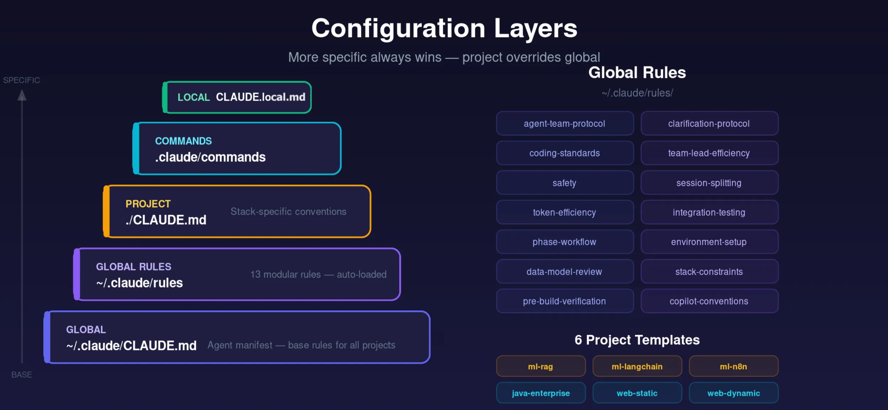
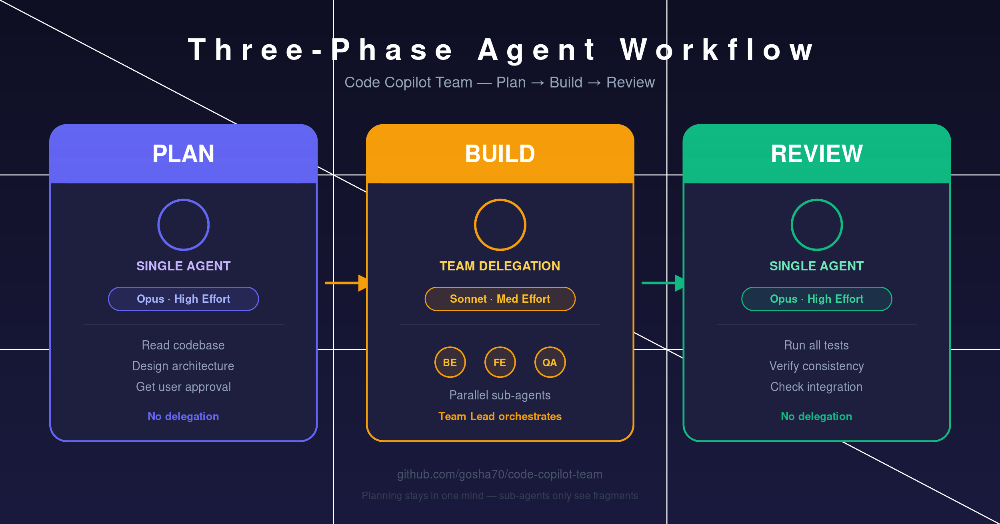
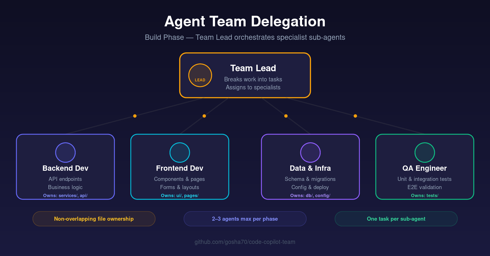

<h1>
  
  Code Copilot Team
</h1>


Reusable, opinionated configuration for AI-assisted coding with multi-agent team delegation. Ships with templates for ML/AI, Enterprise Java, and Web projects.

Built for **Claude Code** as the reference implementation, with the provider-neutral **Pi** enforced harness and portable conventions for Cursor, GitHub Copilot, Windsurf, Aider, and local LLMs.

[](https://github.com/gosha70/code-copilot-team/releases)
[](https://github.com/gosha70/code-copilot-team/actions/workflows/sync-check.yml)
[](https://github.com/gosha70/code-copilot-team/actions/workflows/pi-tests.yml)

> 📖 **Deep dive:** [Stop Fighting AI Agents and Build a Reusable Multi-Agent Dev Environment](https://www.linkedin.com/pulse/stop-fighting-ai-agents-build-reusable-multi-agent-dev-george-ivan-mxwbe) — the full story behind this project, lessons learned from 13+ real build sessions, and why every rule exists.

---

## Quick Start

Get running in about 5 minutes:

```bash
# 1. Clone the latest stable release (master is unreleased, in-development)
git clone --branch v1.1.0 https://github.com/gosha70/code-copilot-team.git
cd code-copilot-team

# 2. Install for your AI tool (two first-class harnesses — all tools listed below)
./scripts/setup.sh --claude-code    # Claude Code → ~/.claude/
./scripts/setup.sh --pi             # Pi (enforced, provider-neutral) → ~/.code-copilot-team/pi/

# 3. Discover what you just installed
./scripts/cct list          # every slash command, skill, and capability
```

**Discover the features:** browse the generated **[Feature Index](docs/features.md)** —
every slash command, skill, and capability in one place — or run `scripts/cct list`
anytime. More install targets (Cursor, Codex, Copilot, Windsurf, Aider, and the
Claude Code plugin) are under [Install options](#install-options-all-tools).

New to the ideas behind it? See [Why this exists](#why-this-exists),
[Spec-Driven Development](#spec-driven-development-sdd), and the
[Documentation](#documentation) index.

## Why This Exists

Every rule in this repo is failure-driven — it exists because we hit the specific failure it prevents, often more than once. After analyzing 13 sessions of a real project build, we identified six recurring patterns: dependency breaks, agents ignoring conventions, context window exhaustion, schema drift during parallel builds, agents not asking clarifying questions, and commit granularity issues. Every rule and gate here exists to catch one of those patterns before it lands.

External reviews, scorecards, and the sources that shaped this harness are collected in [Evidence & Influences](docs/evidence-and-influences.md).

## Further Reading

- [Spec-Driven Development vs Code Copilot Team](docs/sdd-vs-code-copilot-team.md) — Side-by-side comparison with GitHub's Spec Kit. TL;DR: SDD defines *what* to build; Code Copilot Team defines *how to behave* while building it. They're complementary, not competing.


## Spec-Driven Development (SDD)

Code Copilot Team includes a built-in Spec-Driven Development layer that prevents "vibe coding" — the tendency of AI agents to start writing code before requirements are clear. SDD ensures every feature goes through a structured specification process, with the rigor scaled to match the risk.

### How It Works

Every task is classified into one of three **spec modes** based on risk:

| spec_mode | When | What's Required |
|---|---|---|
| **full** | Security, schema changes, integration, features touching >2 files | `plan.md` + `spec.md` + `tasks.md` |
| **lightweight** | Features touching 1–2 files, non-critical changes | `plan.md` + `spec.md` |
| **none** | Bug fixes (non-security), docs, trivial changes | `plan.md` only |

The Plan agent writes `plan.md` with a YAML frontmatter block that declares `spec_mode`, `feature_id`, `risk_category`, and `justification`. The Build agent reads this frontmatter and gates itself accordingly — it won't proceed on a `full` task without a complete `spec.md`, and it won't proceed on any task that has unresolved `[NEEDS CLARIFICATION]` markers.

### The Four Artifacts

SDD uses exactly four artifact types (no checklists, no extra process):

| Artifact | Purpose | When Created |
|---|---|---|
| `plan.md` | Implementation plan with frontmatter gating | Always (all modes) |
| `spec.md` | Requirements, user scenarios, constraints | `full` and `lightweight` only |
| `tasks.md` | Task breakdown with story and priority markers | `full` only |
| `lessons-learned.md` | Cross-project learnings for future sessions | End of project |

Templates for all four live in `shared/templates/sdd/` and are available across all adapters.

### Three-Layer Gating

SDD enforcement operates at three levels:

1. **Agent-level** — The Build agent reads `plan.md` frontmatter and conditionally requires `spec.md` and resolves `[NEEDS CLARIFICATION]` markers before proceeding.
2. **CI validation** — `scripts/validate-spec.sh` runs on every PR touching `specs/`. It validates frontmatter fields, checks for required files per spec_mode, and enforces justification for `spec_mode: none`.
3. **Hooks** — Existing hooks remain untouched; SDD gating is additive, not intrusive.

### Spec Artifacts Location

All SDD artifacts live in the versioned `specs/` directory, organized by feature:

```
specs/
└── <feature-id>/
    ├── plan.md              ← Always present
    ├── spec.md              ← full / lightweight
    ├── tasks.md             ← full only
    ├── lessons-learned.md   ← End of project
    └── collaboration/       ← Peer review artifacts (dual mode)
        ├── plan-consult.md  ← Peer review of plan phase
        └── build-review.md  ← Peer review of build phase
```

### Risk Classification

The `spec-workflow.md` rule defines risk categories that map directly to spec_mode:

| Risk Category | spec_mode | Examples |
|---|---|---|
| `security` | full | Auth changes, secrets handling, permission logic |
| `schema` | full | Database migrations, API contract changes |
| `integration` | full | Third-party integrations, cross-service changes |
| `feature` | full or lightweight | New features (full if >2 files, lightweight if 1–2) |
| `bug` | none | Non-security bug fixes |
| `docs` | none | Documentation-only changes |

### Adapter Support

SDD rules propagate through the same `shared/ → generate.sh → adapters/` pipeline as all other rules. Claude Code gets enforced gating via agent manifests. Other adapters receive advisory content appropriate to their capabilities:

| Adapter | SDD Support Level |
|---|---|
| Claude Code | **Enforced** — agents gate on frontmatter |
| GitHub Copilot | Full instructions (advisory) |
| Cursor, Windsurf | Always-on rules only (advisory) |
| Aider | Conventions only (advisory) |

### Getting Started with SDD

1. Start a Plan session — describe your feature to the Plan agent.
2. The Plan agent classifies risk, sets `spec_mode`, and writes the appropriate artifacts to `specs/<feature-id>/`.
3. Switch to Build — the Build agent reads the frontmatter and gates itself.
4. CI validates on PR — `validate-spec.sh` catches any missing artifacts or incomplete specs.

No additional setup required — SDD is active by default after installation.

## Shape-Up (Product Bets)

SDD answers *"how do we know we built the right thing?"* — Shape-Up answers *"what do we build next, and how big should it be?"* The two are complementary: a pitch describes the *bet*, SDD's plan/spec/tasks describe the *implementation* underneath one or more scopes of that pitch.

Code Copilot Team ships a local-first Shape-Up implementation: pitches and hill charts as plain files under `specs/pitches/<id>/`, four agents (`pitch-shaper`, `scope-executor`, `cycle-retro`, `cooldown-report`), five slash commands (`/shape`, `/bet`, `/cycle-start`, `/hill`, `/cooldown`), and `validate-pitch.sh` enforcing frontmatter (appetite ∈ `{2w, 4w, 6w}`, bet_status lifecycle, cycle/circuit-breaker conditional rules) on every PR.

Use Shape-Up for product-shaped work — greenfield, ambiguous problem space, multiple possible solutions, time-boxed bets. Use SDD alone for feature-shaped work where the requirement is clear.

📖 **Full guide:** [docs/shape-up-workflow.md](docs/shape-up-workflow.md) — methodology, frontmatter schema, lifecycle diagram, agent reference, install surface, and a worked example.

## Peer Review (Multi-Copilot)

Code Copilot Team supports **dual-copilot peer review** — a second AI provider automatically reviews your work at phase completion. This catches blind spots that a single provider misses, using the same structured collaboration protocol regardless of which providers are involved.

### Prerequisites

1. **Install Code Copilot Team** — run `setup.sh --claude-code` (see [Quick Start](#quick-start)). This installs all peer review components:
   - `peer-review-runner.sh` and `providers-health.sh` to `~/.local/bin/`
   - `peer-review-on-stop.sh` hook to `~/.claude/hooks/`
   - `/phase-complete` command to `~/.claude/commands/`
   - Provider profile seed to `~/.code-copilot-team/providers.toml`

2. **Install the peer provider CLI** — the peer provider must be available on your machine. For example, to use OpenAI Codex as a peer reviewer, install the Codex CLI first.

3. **Verify provider availability:**
   ```bash
   providers-health.sh
   ```

### Setup — New Projects

```bash
# 1. Init project from template
claude-code init ml-rag ~/projects/my-app

# 2. Start session with peer review
claude-code --peer-review codex ~/projects/my-app
```

### Setup — Existing Projects

No project-level changes required. Peer review is driven entirely by session flags and global hooks:

```bash
# Just add --peer-review to your usual launch command
claude-code --peer-review codex ~/projects/existing-app

# Or use the default peer from your provider profile
cd ~/projects/existing-app && claude-code --peer-review
```

### How It Works

1. **Start a session with peer review enabled:**
   ```bash
   claude-code --peer-review codex ~/projects/my-app   # explicit peer provider
   claude-code --peer-review ~/projects/my-app          # default peer from profile
   claude-code --peer-review-off ~/projects/my-app      # disable for this session
   claude-code --peer-review-scope code ~/projects/my-app  # scope: code|design|both
   ```

2. **Work normally** through the Plan → Build phases. Claude detects `CCT_PEER_REVIEW_ENABLED=true` in the environment and sets `collaboration_mode: dual` in the SDD plan.

3. **Run `/review-submit`** after completing work — the Build agent runs this to start the review loop. The runner spawns a reviewer LLM in a read-only sandbox, captures structured findings, and returns a verdict. On FAIL, the agent addresses findings and resubmits. On PASS, proceed to `/phase-complete`.

4. **Run `/phase-complete`** when review passes — validates that `loop-summary.json` exists, runs the post-phase checklist, and presents the commit for approval.

5. **Review the artifact** — the collaboration artifact (`build-review.md` or `plan-consult.md`) is written to `specs/<feature-id>/collaboration/` with structured findings and a verdict.

### Provider Profile

Peer providers are configured in `~/.code-copilot-team/providers.toml` (seeded by setup):

```toml
[defaults]
peer_for.claude = "codex"
peer_for.codex = "claude"

[providers.codex]
type = "cli"
# Flags verified by executing codex-cli 0.147.0; see
# specs/codex-provider-command/verification/codex-reviewer-capture.md.
# `2>/dev/null` is required: codex echoes the prompt to stderr and the runner
# captures providers with `2>&1`, which made a FAIL parse as PASS.
command = "codex exec --color never -s read-only --skip-git-repo-check - < {review_request} 2>/dev/null"
timeout_sec = 300
healthcheck = "codex --version"

[providers.ollama]
type = "ollama"
command = "ollama run {model} < {review_request}"
model = "llama3"
timeout_sec = 600
healthcheck = "ollama list"
```

Every provider currently requires a `command` template with `{review_request}` and `{model}` placeholders. The `type` field (`cli`, `openai-compatible`, `ollama`, `custom`) declares the provider topology and will enable type-aware dispatch and dedicated adapter scripts in a future update. See `shared/templates/provider-profile-template.toml` for all type-specific fields and commented-out examples.

### Safety Model

- **Fail-closed** — enforced at two levels: (1) `/phase-complete` requires `loop-summary.json` with PASS or bypass before proceeding, (2) the stop hook blocks session end if review was started but not completed (exit 2). If review was never started, the hook warns but does not block.
- **Circuit breakers** — max rounds (default 5), wall-clock timeout (15 min), stale findings, provider unavailability. All escalate to human via `/review-decide`.
- **Read-only sandbox** — reviewer runs in a snapshot copy; real working tree is never modified by the reviewer.
- **Escape hatch** — set `CCT_PEER_BYPASS=true` to skip validation. CI rejects bypass artifacts.
- **Identity tracking** — collaboration artifacts include `peer_profile` (provider name) and `runner_fingerprint` (SHA-256 of provider config) for auditability.

### Collaboration Modes

| Mode | When | What Happens |
|---|---|---|
| **single** (default) | No `--peer-review` flag | Standard single-provider workflow, no peer review |
| **dual** | `--peer-review [provider]` | Peer reviews at `/phase-complete`, artifacts written to `specs/` |

### Independent Reviewer Setup (Codex)

Complementary to the runner loop above: configure a copilot as the project's
**independent senior reviewer** through its own instruction-file mechanism —
persistent review rules that apply to every `/review`, `codex review`, or
GitHub `@codex review` session, with no runner involved.

The reviewer must classify each change as `on-target`, `overcomplicated`, or
`off-target` against the originating request. Passing tests cannot substitute
for that scope check, and every review includes an explicit simplification pass.

```bash
# Install for a project (Codex first; the dispatch table takes future tools)
./scripts/setup-reviewer.sh --codex /path/to/project

# Then fill in the project-owned configuration and start a fresh session
$EDITOR /path/to/project/docs/CODE_REVIEW_PROJECT.md
```

What it installs, and who owns what:

| File | Ownership | On re-run |
|---|---|---|
| `docs/CODE_REVIEW.md` | Managed (marker header) | Refreshed from `shared/review/` |
| `docs/CODE_REVIEW_PROJECT.md` | **Project-owned** | Never overwritten; uninstall keeps it once customized |
| `AGENTS.md` loader block | Managed (marker-guarded) | Refreshed in place; content outside markers untouched |

The review rules enforce a read-only boundary, complete-diff scope, SDD/origin
gating, evidence-backed findings (P0–P3), and `PASS`/`FAIL`/`INCONCLUSIVE`
verdicts — never `PASS` because another agent said tests passed. CCT-generated
`AGENTS.md` files get the loader at the generator layer (`generate.sh`), so
regeneration preserves it; a stale generated file without the loader makes the
installer fail loudly (exit 65) rather than report an inert setup as success.
Spec: `specs/copilot-reviewer-setup/`.

## LLM Wiki Maintainer

`code-copilot-team` ships a Karpathy-pattern LLM Wiki maintainer that
turns `knowledge/raw/` into a curated, cited, agent-readable markdown
layer under `knowledge/wiki/`. Five operations, one CLI:

```bash
./scripts/wiki ingest <source>          # multi-page write plan against existing wiki state
./scripts/wiki promote <proposal-dir>   # atomic apply (only writer to the canonical wiki content tree, excluding .audit/)
./scripts/wiki query "<question>"       # index-first synthesis with citations
./scripts/wiki query --file-back "..."  # round-trip the answer back into a patch-set
./scripts/wiki lint                     # structural lint (frontmatter, links, slugs)
./scripts/wiki lint --health [--strict] # knowledge-health (contradictions, stale claims, weak orphans, missing cross-links)
./scripts/wiki audit-flush              # commit pending ingest-log lines (reject-only durability)
./scripts/wiki audit-flush --dry-run    # report count + blob SHA without committing
```

**Human approval is always gating, and the source-control boundary
is explicit: the wiki is source-controlled, the proposal workspace
is not.** `wiki ingest` writes draft proposals to a local-only
`doc_internal/proposals/` directory (gitignored — proposals are
working drafts, not canonical state). `wiki promote` is the only
operation that writes to the canonical `knowledge/wiki/` content tree;
`wiki ingest` has one additional tracked write: appending to the
append-only `knowledge/wiki/.audit/ingest-log.md` audit ledger. The
audit trail under `knowledge/wiki/.audit/` records every `wiki ingest`
decision (timestamp, source SHA, backend, disposition, reason) in
`ingest-log.md`, and every accepted proposal's original LLM draft in
`knowledge/wiki/.audit/proposals/<date>-<slug>/` (applied atomically
by `wiki promote`). `wiki audit-flush` (shipped in
[gosha70/code-copilot-team#37](https://github.com/gosha70/code-copilot-team/issues/37))
closes the reject-only durability gap: run it after a reject-only session
to commit any pending audit lines in a focused `audit: flush N pending
ingest-log line(s)` commit. Promotion
history is traceable via git on `knowledge/wiki/` plus
`knowledge/wiki/log.md`.

The CLI auto-detects an installed copilot backend in the order
`claude → codex → cursor`. Override with `--backend <name>` or
`WIKI_INGEST_BACKEND=<name>`. Use `--backend test` for the
deterministic stub backend (no LLM call; this is what CI uses).

For the v1 single-source flow, the legacy invocation
`./scripts/wiki-ingest <source>` is preserved as a backwards-compat
alias.

### Operator docs

- Full operator workflow: [`knowledge/README.md`](knowledge/README.md) §5e.
- Workflow page: [`knowledge/wiki/workflows/run-wiki-ingest.md`](knowledge/wiki/workflows/run-wiki-ingest.md).
- Design rationale: [`specs/wiki-ingest-pipeline/spec.md`](specs/wiki-ingest-pipeline/spec.md).
- Schema: [`knowledge/wiki/schema/`](knowledge/wiki/schema/) — page types, ingest rules, citation rules, lint rules, curator persona.

## Benchmark Harness

`code-copilot-team` ships a benchmark-agnostic harness for evaluating AI
copilots and LLMs on real coding tasks under reproducible isolation —
so you can answer "which copilot/model is actually better on this kind
of work?" with a controlled run record instead of a vibe.

It does **not** author benchmarks; it runs established public ones
(Aider Polyglot, SWE-bench Verified, BigCodeBench) and custom CCT
fixtures through one adapter contract. There are two entry points — a
terse daily-driver wrapper and the underlying harness CLI:

```bash
# Daily driver — safe by default (no-arg run is a free stub smoke + env detection)
./scripts/bench                                          # prove the plumbing, no LLM call, no spend
./scripts/bench sonnet ollama:qwen2.5-coder:7b           # compare two models on a coding task
./scripts/bench --preset local-vs-cloud --runs 5         # curated comparison preset
./scripts/bench --list-presets                           # discovery: available presets
./scripts/bench --list-providers                         # discovery: detected backends/providers

# Underlying harness
./scripts/benchmark list                                 # adapters + backends + judges
./scripts/benchmark run --benchmark aider-polyglot \
    --backend claude-code --model sonnet --runs 3        # one (backend, model) run
./scripts/benchmark compare --config my-compare.json     # multi-LLM comparison
./scripts/benchmark report --run-dir runs/<ts>/ --html --csv  # rich report (HTML + SVG charts + CSV)
```

**What it measures.** Deterministic scoring is the primary signal —
build/test/lint pass, required files present, elapsed time, token usage
— with a calibrated winner-declaration rule (`Δ > 2σ AND ≥ threshold`)
that refuses to call a winner on noise. A **calibrated LLM judge**
(issue #34) adds a secondary quality signal (idiomaticity, error
handling, test thoughtfulness, security hygiene), but only after it's
proven to correlate with human reviewers (Spearman ρ ≥ threshold per
dimension); it never overrides the deterministic verdict, and a run
that fails its tests can never win on judge-only criteria. No
dollar-cost estimates are ever reported.

**Backends** (the agent driving the task): `claude-code`, `codex`,
`aider`, plus a deterministic `stub` for CI. Local models (vLLM,
Ollama, LM Studio) are reached as *providers* through the gateway env
vars — `./scripts/bench sonnet vllm:<model>@<endpoint>` probes the
endpoint and spawns an ephemeral Anthropic↔OpenAI proxy when needed.

### Operator docs

- Full harness guide, CLI reference, adapter/backend/judge contracts: [`benchmarks/README.md`](benchmarks/README.md).
- 60-second quickstart: [`benchmarks/README.md` § 60-second quickstart](benchmarks/README.md#60-second-quickstart).
- Routing-quality evaluation (measuring CCT's router against control arms, #109 E1): [`benchmarks/README.md` § Routing-quality evaluation](benchmarks/README.md#routing-quality-evaluation-e1-of-109-issue-260).
- Shadow-mode routing analysis (consuming E1 evidence sets through session analytics + Studio, #109 E2): [`scripts/session_analytics/README.md` § Routing evidence](scripts/session_analytics/README.md#routing-evidence--shadow-mode-e2-of-109-issue-261).
- Calibration gates + shadow kNN (the #109 §12 promotion conditions made executable, #109 E3): [`scripts/session_analytics/README.md` § Calibration gates](scripts/session_analytics/README.md#calibration-gates--shadow-knn-e3-of-109-issue-266).
- Design rationale: [`specs/benchmark-harness/spec.md`](specs/benchmark-harness/spec.md) and the per-feature spec bundles under [`specs/`](specs/).

## UI Design Harness

Stops copilot-generated UI from converging on the generic "AI-slop" look (default fonts, purple gradients, centered cards, `<div onClick>` a11y) and gates it with a closed visual-review loop. Two on-demand skills + a shippable, tool-agnostic runner.

- **Steering bundle** — every UI project commits `DESIGN.md` + `design/tokens.json` (DTCG). The `design-system` skill derives a domain-fit direction (brand archetype + user + density) and overrides the framework defaults (neutral, accent, font, radius) so output is bespoke by construction, not generic.
- **Visual-review loop** — `npm run copilot:review` boots the app, runs an axe-core WCAG 2.2 AA gate + an anti-slop rubric, screenshots at 375/768/1440, and a critic scores against `DESIGN.md`: the `visual-reviewer` agent on Claude Code (reads the PNGs), or a vision LLM over `fetch` for other tools. Iterates to a quality bar (cap 3); degrades to an HTTP smoke when Playwright is absent (a dead dev server still fails).
- **Enable it** — the `web-dynamic` / `web-static` templates reference it. Scaffold into any project from `~/.claude/templates/ui-harness/` (`harness/`, `DESIGN.md`, `design/`), then add `"copilot:review": "cd harness && npm run harness:verify"` to `package.json`.

Skills: `design-system`, `visual-review` · Agent: `visual-reviewer` · Template: `ui-harness`.

## What You Get



- **Layered rules** — 4 global rules (`~/.claude/rules/`) auto-load every session; 20 on-demand skills (`~/.claude/skills/*/SKILL.md`) loaded by phase agents when needed.
- **Phase agents** (`~/.claude/agents/`) — 4 phase agents (research, plan, build, review) plus 10 utility agents (code-simplifier, cooldown-report, cycle-retro, doc-writer, phase-recap, pitch-shaper, scope-executor, security-review, verify-app, visual-reviewer).
- **Hooks** (`~/.claude/hooks/`) — 11 lifecycle scripts: test verification, type checking, auto-format, file protection, git safety guards, context re-injection, peer review trigger, desktop notifications, plus 3 self-guarding MemKernel hooks (session recall, pre-compact checkpoint, post-compact recovery) that activate only when MemKernel is installed.
- **11 project templates** — pre-configured `CLAUDE.md` files with stack-specific conventions, slash commands, and agent team roles for each project archetype.
- **Four-phase workflow** — Research → Plan → Build → Review. Plus **Ralph Loop** for single-agent autonomous iteration.

- **Adaptive launcher** (`claude-code`) — uses `cmux` on macOS, `tmux` elsewhere, with git context display, `--peer-review` flags, and `sync` for keeping projects aligned with template updates.

## Install options (all tools)

```bash
# 1. Clone the latest stable release (drop --branch for unreleased master)
git clone --branch v1.1.0 https://github.com/gosha70/code-copilot-team.git
cd code-copilot-team

# 2. Install for your tool(s)
./scripts/setup.sh --claude-code                    # Claude Code → ~/.claude/
./scripts/setup.sh --pi                             # Pi (enforced) → ~/.code-copilot-team/pi/
./scripts/setup.sh --codex                          # OpenAI Codex → ~/.codex/
./scripts/setup.sh --cursor ~/my-project            # Cursor → project/.cursor/
./scripts/setup.sh --github-copilot ~/my-project    # GH Copilot → project/.github/
./scripts/setup.sh --windsurf ~/my-project          # Windsurf → project/.windsurf/
./scripts/setup.sh --aider ~/my-project             # Aider → project/CONVENTIONS.md

# Or install everything at once
./scripts/setup.sh --all ~/my-project

# Re-sync after pulling repo updates
git pull && ./scripts/setup.sh --sync --claude-code
```

The legacy `./claude_code/claude-setup.sh` path still works — it delegates to the adapter.

After `git pull`, run `--sync` to regenerate configs and re-install.

### Alternative: Install as a Claude Code Plugin

For Claude Code users who prefer the plugin system over `setup.sh`:

```bash
# Add the CCT marketplace (one-time)
/plugin marketplace add gosha70/code-copilot-team

# Install the hooks plugin
/plugin install code-copilot-team@code-copilot-team
```

This installs the same hooks (file protection, auto-format, type verification, context re-injection, git safety, notifications) as `setup.sh`, but managed through Claude Code's plugin system. Update installed plugins with `/plugin marketplace update`. The plugin does not include peer-review or memkernel hooks — those are CCT-pipeline-specific and remain in the `setup.sh` path.

Both install paths coexist. Use `setup.sh` for the full install (skills, agents, templates, hooks, peer review) or the plugin for hooks only.

### Recommended: Install LSP Plugins (Claude Code)

For continuous type-error feedback during edits, install the appropriate code-intelligence plugin. Each requires its language-server binary on `$PATH`:

```bash
# Install the language server first, then the plugin:
pip install pyright && /plugin install pyright-lsp@claude-plugins-official           # Python
npm i -g typescript-language-server typescript && /plugin install typescript-lsp@claude-plugins-official  # TypeScript
go install golang.org/x/tools/gopls@latest && /plugin install gopls-lsp@claude-plugins-official  # Go
```

These provide native LSP diagnostics and are preferred over the bundled `verify-after-edit.sh` hook. The hook remains as a fallback for languages without an LSP plugin. See the [official plugin catalog](https://claude.com/plugins) for all available languages.

## Start a New Project

```bash
# Initialize from a template
claude-code init ml-rag ~/projects/my-rag-app

# Start a Claude session in the project
claude-code ~/projects/my-rag-app
```

## Start in an Existing Project

```bash
# Just point the launcher at it — global rules load automatically
claude-code ~/projects/existing-api
```

## Sync a Project to Latest Template

After pulling repo updates, sync your project's commands and `.claude/` files against the latest template:

```bash
# 1. Update global config + templates from repo
git pull && ./scripts/setup.sh --sync --claude-code

# 2. Preview what would change (safe — no files modified)
claude-code sync ~/projects/my-rag-app --dry-run

# 3. Apply the sync
claude-code sync ~/projects/my-rag-app
```

Sync updates commands and `.claude/` contents (e.g. `remediation.json`) but never overwrites your `CLAUDE.md` — it shows a diff for manual review instead. Projects initialized with `claude-code init` have a `.claude/template.json` that tracks the template; older projects are matched by their `CLAUDE.md` heading.

## Available Templates



| Template | Stack | Agent Team |
|---|---|---|
| `ml-rag` | Python · FAISS/Chroma · Neo4j/NetworkX | Team Lead, RAG Engineer, KG Engineer, Data Analyst, QA |
| `ml-langchain` | Python · LangChain/LangGraph/LangSmith | Team Lead, Agent Developer, Integration Engineer, QA & Eval |
| `ml-app` | Python · FastAPI · LiteLLM · Next.js/React | Team Lead, Backend Dev, Frontend Dev, ML/AI Engineer, QA |
| `ml-utils` | Python · MCP SDK · Chroma/Qdrant · tree-sitter | Team Lead, MCP Engineer, Retrieval Engineer, Storage Engineer, QA |
| `ml-n8n` | Python · n8n · REST/webhooks | Team Lead, Workflow Designer, Python Developer, QA & DevOps |
| `java-enterprise` | Spring Boot · Kafka · GraphQL · React | Team Lead, Backend Dev, Frontend Dev, Data & Messaging, QA, DevOps |
| `web-static` | Astro/Next.js/Hugo · Tailwind | Team Lead, Frontend Dev, Content & SEO, QA |
| `web-dynamic` | Next.js/Remix · Node/Python · PostgreSQL | Team Lead, Frontend Dev, Backend Dev, QA, DevOps |
| `java-tooling` | Java 21 · Gradle · JSR 269 · JavaPoet · Spring AI MCP | Team Lead, APT Engineer, MCP Specialist, Plugin Dev, QA |
| `gradle-plugin` | Kotlin · Gradle 8 · `Plugin<Project>` · TestKit matrix · Plugin Portal | Team Lead, Plugin Eng, Functional Test Eng, Build & Release |
| `domain-pack` | Versioned content (TBX/JSON-LD/CSV) · Maven Central + PyPI dual publish | Team Lead, Content Curator, JVM Wrapper Eng, Python Wrapper Eng, Release & CI |

> **`ui-harness`** — an add-on bundle (not a stack) that layers the [UI Design Harness](#ui-design-harness) onto any web project: `DESIGN.md` + DTCG tokens + the `harness/` visual-review runner.

### Bundled CI Workflows

Each template ships a `.github/workflows/` file so CI is wired up the moment the consumer adds their toolchain manifest.

| Stack | Workflow file | What it runs |
|---|---|---|
| `ml-app`, `ml-rag`, `ml-langchain`, `ml-n8n`, `ml-utils` | `python.yml` | ruff · mypy · pytest --cov · matrix: 3.10, 3.11, 3.12 |
| `java-enterprise`, `java-tooling` | `gradle.yml` | `./gradlew build check test` · matrix: JDK 17, 21 · optional `publish-staging` on tags |
| `web-static`, `web-dynamic` | `node.yml` | lint · typecheck · test · matrix: Node 20, 22 · auto-detects npm/yarn/pnpm |
| `domain-pack` | `pack-content.yml` + `pack-publish.yml` | manifest + content schema validation on PR · coordinated Maven Central + PyPI publish on tag |
| `gradle-plugin` | `gradle-plugin.yml` | unit tests · TestKit functional matrix (Gradle 8.5/8.10/current) · sample-consumer smoke · Plugin Portal publish on tag |

**Auto-skip on empty project.** Each workflow's job is gated on a toolchain marker (`pyproject.toml` / `setup.py` / `setup.cfg` for Python, `package.json` for Node, `gradlew` for Gradle — the wrapper, since build steps invoke `./gradlew`). A freshly bootstrapped project with no marker yet gets a green skip rather than a red failure. The job activates as soon as the consumer adds the marker file. Gradle projects that have build scripts but no wrapper get a notice nudging them to run `gradle wrapper`.

**Matrix override via `workflow_dispatch`.** Every workflow accepts a manual trigger with an optional version input (e.g. `python-version: "3.12"` or `node-version: "20"`). Leave it blank to run the full matrix; set it to a specific version to run that one only.

**Dual-branch trigger.** All workflows fire on push to `master` or `main` — whichever convention a project uses.

**Bootstrap path.** `claude-code init <type>` copies `.github/workflows/` into the new project automatically. `claude-code sync` keeps the workflow file up to date alongside `remediation.json` and commands.

## How Configuration Layers Work

```
~/.claude/CLAUDE.md                ← Global agent manifest (base)
~/.claude/rules/*.md               ← Global rules (always loaded, 4 files)
  ├── coding-standards.md          SOLID, quality gates, prohibited patterns
  ├── copilot-conventions.md       Cross-tool portable conventions
  ├── safety.md                    Destructive action guards, secrets policy
  └── copyright-headers.md         Copyright header rules for generated source files
~/.claude/skills/*/SKILL.md        ← On-demand skills (SKILL.md format, 20 skills)
  ├── agent-team-protocol/         Three-phase workflow, delegation rules
  ├── clarification-protocol/      Ask before implementing ambiguous requirements
  ├── environment-setup/           Environment and config verification
  ├── infra-verification/          Infrastructure artifact verification ("build it, run it")
  ├── integration-testing/         Test integration points early
  ├── memkernel-memory/            MemKernel persistent memory protocol (self-guarding)
  ├── opus-4-7-features/           Opus 4.7 optimization (xhigh effort, auto mode, caching)
  ├── phase-workflow/              Phase transition rules and boundaries
  ├── provider-collaboration-protocol/  Peer review protocol and collaboration rules
  ├── ralph-loop/                  Single-agent autonomous iteration loop
  ├── review-loop/                 Peer review loop with findings and resolutions
  ├── spec-workflow/               SDD spec gating and artifact management
  ├── stack-constraints/           Stack version and compatibility guards
  ├── team-lead-efficiency/        Limit agents, poll frequency, no re-work
  └── token-efficiency/            Diff-over-rewrite, context economy
~/.claude/agents/*.md              ← Phase + utility agents (14 files)
  ├── research.md                  Research phase agent
  ├── plan.md                      Plan phase agent
  ├── build.md                     Build phase agent
  ├── review.md                    Review phase agent
  ├── code-simplifier.md           Simplify recently changed code
  ├── cooldown-report.md           Cooldown report: fixes shipped + pitches ready
  ├── cycle-retro.md               Cycle retrospective from pitch, hill, and git log
  ├── doc-writer.md                Generate and update documentation
  ├── phase-recap.md               Summarize completed phase
  ├── pitch-shaper.md              Shape a rough idea into a Shape-Up pitch
  ├── scope-executor.md            Execute a single scope of an active pitch
  ├── security-review.md           Scan for security vulnerabilities
  ├── verify-app.md                End-to-end project verification
  └── visual-reviewer.md           Visual-review loop for generated UI
~/.claude/hooks/*.sh               ← Deterministic lifecycle hooks (always active, 11 files)
  ├── verify-on-stop.sh            Run test suite when Claude finishes responding
  ├── verify-after-edit.sh         Run type checker after source file edits
  ├── auto-format.sh               Auto-format edited files
  ├── protect-files.sh             Prevent edits to protected files
  ├── protect-git.sh               Guard destructive git commands (push --force, reset --hard)
  ├── peer-review-on-stop.sh       Trigger peer review on phase completion
  ├── reinject-context.sh          Re-inject session context on prompt submit
  ├── notify.sh                    Desktop notifications (macOS + Linux)
  ├── memkernel-recall.sh          Recall MemKernel context on session start (self-guarding)
  ├── memkernel-pre-compact.sh     Save checkpoint before compaction (self-guarding)
  └── memkernel-post-compact.sh    Recover context after compaction (self-guarding)
~/.claude/settings.json            ← Hooks wiring and global settings
./CLAUDE.md                        ← Project-level (overrides global)
./.claude/commands/*.md            ← Project slash commands
./CLAUDE.local.md                  ← Personal overrides (gitignored)
```

Project-level rules override global rules. More specific always wins.

## Cost & Safety Caps

An autonomous build (`auto-build-loop.sh`, `claude-code build …`) runs under
spend and time caps declared in `specs/<feature-id>/automation.json`,
scaffolded from `shared/templates/sdd/automation-template.json`:

```json
"caps": {
  "wall_clock_sec": 14400,
  "cost_usd": 25
}
```

**The cost default is $25 and it is real money.** A single build phase can
cost several dollars on a large model, so a multi-phase feature can approach
that default. Set `caps.cost_usd` deliberately before launching rather than
inheriting it.

**Live visibility.** Every phase gate prints the running total:

```
[auto-build] phase 1 complete — $4.24 spent of $25.00 cap ($20.76 left)
```

Unmetered reviewer invocations are debited as flagged conservative estimates,
and the line says so when any estimate is included. The final
`automation-summary.md` repeats the metered/estimated split.

**When the cap is hit** the run parks rather than stopping dead:

```
[auto-build] PARK: cap_exceeded — cost cap: spent $24.10 metered + $2 estimated of $25
```

Raise `caps.cost_usd` in `automation.json` and re-run with `--resume`; the
resume path re-reads `caps` from the live config and restarts the wall-clock
guard.

**Raising the cap mid-run.** Config is frozen into
`.cct/auto-build/<feature-id>/config.snapshot.json` at launch, so most edits
to `automation.json` during a run are ignored by design. `caps.cost_usd` is
the exception: attended profiles (`advisory`, `pr`, `merge`) re-read it from
the live config **at each phase gate**, so a raise applies without waiting to
be parked. The change is announced on stdout and journalled as `cap_updated`.
A non-positive value is ignored. A **lower** cap is honoured too — winding
an expensive run down is a legitimate action — and is enforced immediately:
if spend already exceeds the new value the gate parks `cap_exceeded` there
and then, rather than committing and finishing over budget. The
`unattended` profile does **not** re-read caps — such a run is bound to the
config it was admitted against, and an unaudited mid-run policy change
would break that binding; it must park or terminate to change a cap.

> **Upgrading from before v1.1?** The cost cap was silently inert in earlier
> versions: the driver parsed `total_cost_usd` from the reviewer CLI's result
> as a single object, but the current CLI returns an array, so spend
> evaluated to `0` and `caps.cost_usd` never accrued or triggered (fixed in
> #197/#198). If you relied on that cap for protection, you were not
> protected. Re-check the value you have set before your next run.

## Coverage Contract (auto-build)

An autonomous build can additionally enforce a **frozen coverage contract**
(#222, increment C1 of #190) declared in `automation.json`:

```json
"verification": {
  "coverage": {
    "command": "npm run coverage",
    "artifact": "coverage/coverage-summary.json",
    "parser": "istanbul",
    "baseline": "none",
    "min_line_pct": 80
  }
}
```

- **Frozen during preflight.** The preflight initialiser resolves floors
  (from `coverage.preset` naming
  `shared/templates/<preset>/verification-preset.json`, with
  `automation.json` overriding per key), captures the base branch's
  baseline for brownfield runs (`baseline: "admission"` names the point in
  the run, not the actor), and freezes the full contract into the run
  ledger. Every later gate reads ONLY that frozen copy — editing the
  preset, the config, or the on-disk contract after initialisation moves
  nothing, and tampering parks an attended run or terminates an unattended
  one.
- **Enforced at `floor_enforced_at`** (`landing`, the default, or `phase`),
  in a throwaway worktree at HEAD. That is side-effect isolation, not a
  security sandbox: harness-provided paths (`CCT_PROJECT_DIR`,
  `CCT_SPECS_DIR`) are rebound into the worktree, so ordinary writes never
  reach the canonical checkout, but arbitrary project code that goes
  looking for the real checkout is not confined. Floors are absolute;
  brownfield runs additionally fail on
  regression beyond `max_regression_pct`, measured in percentage points
  against the frozen baseline. A floor whose metric the artifact lacks
  fails closed.
- **Failure parks (attended) or terminates (unattended)**, naming the
  measured number and the floor. Attended parks are resumable: raise the
  coverage (or fix the tooling), commit, and `--resume` — anything
  committed past the last reviewed HEAD gets its own review PASS before
  the gate reruns.
- Parsers: `istanbul` and `lcov` (`cobertura`/`jacoco` are refused as not
  implemented in C1). `skip_is_failure` belongs to the visual gate below.

## Runtime Conformance Evaluator (auto-build)

A run can also require that mapped requirements be proven against the
**running application** (#242, increment C2 of #190 §6). Whether it is
required is DERIVED from `specs/<feature>/verification.yaml` — any `FR-N`
mapped to a `kind: runtime_conformance` verifier — never from a config
flag; an operator-supplied `conformance.required` is rejected by name.

```json
"verification": {
  "conformance": {
    "evaluator": "codex-eval",
    "timeout_sec": 600
  },
  "app": {
    "command": "npm start",
    "ready": { "url": "http://127.0.0.1:3000/health", "timeout_sec": 30 },
    "stop_timeout_sec": 10
  }
}
```

The application is declared at `verification.app`, one level up from the
evaluator, because the visual gate (#239, increment C3) consumes the same
running instance: the driver launches it once per landing gate however
many consumers read it. `verification.conformance.app` is refused by name
with a migration message — a silently ignored block would leave your
launch command inert.

- **The evaluator is a capability, not just a healthy provider.** Its
  providers.toml entry must declare `conformance_command` — an
  evaluator-specific command template (with the `{review_request}`
  placeholder) whose flags and tooling you grant for exercising a running
  app. A reviewer-only provider is refused by name: a read-only review
  profile or a plain prompt-in/text-out adapter can only fabricate runtime
  evidence. Unattended runs refuse at admission (exit 1, no ledger);
  attended runs park at the gate.
- **The driver owns the app.** It launches `app.command` in its own
  process group, captures output to the ledger, proves readiness, and
  stops the whole group (TERM→KILL) afterwards. Readiness is bound to THAT
  launch: the probe must FAIL before the app starts (an already-answering
  responder is unattributable), succeed within `ready.timeout_sec`, and
  the spawned group must still be alive when it does. The evaluator-facing
  address is `app.interface`, else `ready.url`; both must be http(s) and
  share an origin, and command-based readiness requires an explicit
  `app.interface`. The block is REQUIRED whenever `verification.conformance`
  or `verification.visual` is present, and validated by one shared
  implementation so both consumers enforce identical rules.
- **The landing gate executes, it does not infer.** After the coverage
  gate and before finalize/push/PR, every frozen `kind: deterministic`
  verifier is RUN (its own command, bounded), then the evaluator is
  invoked once with a driver-authored request carrying the frozen criteria
  and app interface. It must answer with exactly one fenced JSON block
  echoing every criterion's full tuple plus a `pass`/`fail` verdict and
  evidence; anything missing, duplicated, altered, invented, or malformed
  fails closed. `verification-results.json` records FR → per-verifier
  results, and an FR is green only when all its verifiers are.
- **The checkout may not move.** The gate requires an empty `git status`
  (untracked included) before and after; any mutation by a verifier, the
  app, or the evaluator disposes `git_anomaly`, and a tainted checkout
  suppresses the termination artifact commit and push.
- **Every invocation is accounted for** through the same cost channel and
  caps as reviewers. A measurement comes only from the adapter-written
  cost file; the evaluator's own text is never parsed as a measurement.
  Missing, malformed, or negative values debit the conservative
  per-invocation estimate only when estimates are ACTIVE — always for
  `unattended`, opt-in for attended runs via `unattended.budget`; with
  estimates inactive an unmetered invocation debits nothing, exactly as
  for reviewers. A cost the ledger cannot record disposes
  `cost_accounting_failed` (parking an attended run, terminating an
  unattended one), and that reason deliberately refuses `--resume`
  rather than forgive unrecorded spend.
- All bounds (`timeout_sec`, `ready.timeout_sec`, `stop_timeout_sec`) are
  positive INTEGER seconds — the gate enforces them with integer shell
  arithmetic, so a fractional value would be uncomputable rather than
  merely imprecise.

## Visual Verification Gate (auto-build)

A run whose spec maps any FR to a `kind: visual` verifier additionally
requires the **driver-owned visual gate** (#239, increment C3 of #190 §6).
As with conformance, the requirement is DERIVED from
`specs/<feature>/verification.yaml` — never from a config flag (an
operator-supplied `required_when_ui_in_scope` is rejected by name):

```json
"verification": {
  "visual": {
    "command": "npm run copilot:review",
    "artifact": "tmp/ui/critique-feedback.json",
    "url": "http://127.0.0.1:3000/",
    "timeout_sec": 900,
    "skip_is_failure": true
  },
  "app": { "command": "npm start", "ready": { "url": "http://127.0.0.1:3000/health", "timeout_sec": 30 } }
}
```

- **Frozen during preflight, and unskippable by omission.** The criteria
  (each FR's statement, sha-pinned) are frozen whenever the spec maps
  `kind: visual` — with no `verification.visual` block the command side
  freezes all-null and the gate PARKS rather than waives. `visual.url` is
  the harness's browser base, frozen and same-origin with the resolved
  app address; the shared `verification.app` block (one app object, one
  launch per landing gate) serves conformance and visual alike.
- **The harness runs isolated.** The command executes in a detached
  throwaway worktree at HEAD under C1's environment discipline
  (`CCT_PROJECT_DIR`/`CCT_SPECS_DIR` rebound, `OLDPWD` dropped, the
  review cost channel unset), bounded by `timeout_sec`. Afterwards the
  gate re-proves artifact containment, requires a freshly produced
  regular file, requires the worktree's HEAD unmoved and its tracked
  diff clean, and IMPORTS the evidence into the run ledger
  (`visual/critique-feedback.json` + `harness.log`) as a publication —
  a failed import never leaves an earlier run's PASS in place.
- **The verdict is read in a fixed order** over the ledger copy: closed
  shape → effective mode (absent = degraded) → cross-field consistency →
  `passed` must equal "every criterion is pass" → skip legality →
  `skip_is_failure` policy → exact identity with the frozen criteria →
  per-criterion verdicts (`pass|fail|skip|unreached`). `unreached` is
  ALWAYS red — no policy turns an abort into verification — and a
  non-zero harness exit is fatal even when the artifact reads green.
- **`skip_is_failure` defaults to true** and is frozen with the
  contract: a degraded or mode-less result FAILS even when it says
  `passed: true` — a skipped visual check is never a pass by absence.
  Freezing `skip_is_failure: false` is the only way a degraded run
  lands; the waiver is explicit, journalled, and every waived criterion
  is marked `waived` in `verification-results.json`, so a degraded pass
  is never indistinguishable from full verification. Failures dispose
  `visual_gate` (sharing the commit-bound recovery arm), carrying the
  critic's `critique:`/`fixes:` in the evidence.
- **ESTIMATE-metered, always.** The harness is arbitrary project code,
  so the cost channel is never handed to it and its output is never
  parsed as a measurement: every invocation debits the conservative
  per-invocation estimate when estimates are active (always under
  `unattended`, opt-in for attended runs) and nothing when inactive —
  debited immediately after the harness returns, BEFORE the evidence
  checks, so a failing or evidence-destroying run is still charged. A
  cost the ledger cannot record disposes `cost_accounting_failed`.
- **The isolation threat model is deliberate** (plan decision 10): the
  worktree protects the canonical checkout from persistent TRACKED-file
  mutation and keeps ordinary side effects out of your working copy. It
  is NOT a security sandbox — untracked-evidence forgery inside the
  worktree and swap-and-restore races by an active same-user process
  are out of scope. The gate bounds an unattended pipeline against a
  drifting or sloppy harness, not against a hostile local user.

## LLM Routing Foundation (#109 increment A)

Policy-driven tiered LLM routing — continuing a build on another
provider when the preferred one is unavailable — arrives in increments
(#109). **Increment A routes and executes NOTHING**: it ships the
validated configuration surface, the normalized failure contract, and
read-only inspection commands that later increments act on. With no
routing registry configured, existing build and execution behavior is
unchanged.

- **The registry** (`~/.code-copilot-team/routing.toml`, template at
  `shared/templates/routing/routing.toml.example`) declares execution
  profiles — each a validated combination of backend (`claude-code`,
  `codex`, `pi`), provider, model, capability tier (CLOSED vocabulary:
  `tier1 | tier2`), priority, quota pool (profiles sharing one
  subscription share one exhaustion domain), roles, tool profile, and
  data policy — plus route classes (`tier_order`). The file is a
  CONSTRAINED TOML dialect: only the subset CCT implements is
  accepted; unsupported constructs are rejected by name, never
  approximated. Credentials are REFERENCES (a backend login mode or an
  environment-variable name) — a literal secret anywhere in the file
  is refused, and no routing command ever reads the referenced value.
  `[policy]` accepts only behavior an owning increment enforces.
  Increment D promotes `failback`, `healthy_probes_required`, and
  `minimum_profile_dwell_sec`; `max_switches_per_task` remains refused
  because nothing implements it.
- **Repositories restrict, never grant.** `automation.json` may carry
  a `routing` block that can ONLY narrow the operator's registry —
  disable routing, restrict `allowed_profiles`, pick a default route
  class. Profile definitions, credential/endpoint/identity/capability
  fields are refused by name. Only two behavior-bearing sub-blocks
  have been promoted, both restriction-only: `tier2.delegation_enabled`
  (#254 C) and `recovery.{wake_enabled,auto_failback_enabled}` (#257 D);
  any other key inside them is refused. The effective policy is the most-restrictive combination, and
  the merge proves `effective ⊆ user-registry` over complete
  executable identities — a repo cannot keep a profile id while
  changing what it executes as.
- **The normalized failure contract**
  (`shared/schemas/routing-result.schema.json`) classifies backend
  failures by CAUSE — `quota_exhausted` (shared allowance spent,
  hours-scale) is not `rate_limited` (short throttle); `auth` and
  `invalid_request` never read as "try another profile"; `denied`
  requires an affirmative policy signal and is never rerouted around;
  ordinary build/test failures are `execution`, not provider events;
  anything unmatched is `unknown` and FAILS CLOSED. Increment B owns
  what each cause does; an HTTP status alone never determines cause.
- **Inspection commands** (read-only; no probe, no network, no state
  writes): `cct routing validate` (registry + repo restrictions +
  merge), `cct routing status` (per-profile rows; every profile is
  `unknown` until runtime records state — unknown is never treated as
  healthy; D also renders each next-probe instant and refuses a corrupt
  existing state store instead of displaying it as empty. Credential columns report presence only, where
  `set` means a NON-EMPTY value is present behind the referenced
  variable — never the value itself), and `cct routing explain
  --route-class <class>` (a pure configuration-resolution dry run
  that states it is not an availability decision).

### Tier-1 failover (#109 increment B)

Increment B makes the foundation act. The cooldown supervisor gains an
EXPLICIT opt-in routing mode:

```bash
scripts/cooldown-supervisor.sh <feature> --routing --profile unattended
```

Without `--routing`, supervisor behavior is unchanged — configuration
existing is never activation. With it, every failed attempt is
classified through the frozen nine-cause taxonomy and acted on by a
total normative table:

- **`quota_exhausted` cools the WHOLE quota pool** to the provider's
  reset time (profiles sharing a subscription share the exhaustion —
  the router never wastes an attempt on a sibling of a spent pool);
  a bounded fallback cooldown applies when reset evidence is absent.
- **`rate_limited` retries the SAME profile exactly once**
  (Retry-After honored) before failing over; `auth` disables exactly
  that profile and B never re-enables it automatically — time-based
  decay applies only to cooldowns, and increment D owns disabled-state
  recovery; request-local incompatibilities never poison a
  profile for future work; `denied` and `unknown` fail closed —
  never rerouted around; ordinary build/test failures follow the
  existing breaker path, never provider health.
- **Selection is a deterministic total order** (tier → priority →
  profile id) over the effective policy, journaled per candidate;
  Tier-2 profiles are never selected (increment C owns them).
- **Crash safety is a frozen ordering** of durable artifacts
  (attempt-started → fresh child → versioned terminal result carrying
  the RECORDED decision → idempotent state application → checkpoint).
  An attempt with no terminal result is `routing_attempt_indeterminate`
  — never replayed, never assumed failed; a result without its
  checkpoint applies the recorded decision WITHOUT relaunching, bound
  to the persisted identity (a changed registry cannot retarget it).
- **No session ever crosses profiles or providers** — a new profile
  cold-starts its backend from repository + ledger state. Credential
  values exist only in the spawned child environment, and child
  output is secret-scrubbed before display or persistence.
- **Model identity is tri-state**: verified match, fail-closed
  `routing_model_identity_mismatch` (a substituting gateway is never
  rerouted around), or explicitly-unverified null — requested and
  effective are never conflated.
- **Reviewer independence is re-evaluated at every launch**: the
  gating reviewer's PROVIDER identity (primary) and model
  (conservative secondary) are checked against the active builder;
  a collision is terminal (`routing_reviewer_not_independent`), and
  the journal carries one closed tri-state
  (`independence=independent|not_independent|unevaluable`) —
  unevaluable is visible but never claimed as independence. The
  active builder identity lands in the run ledger
  (`routing_identity`, present only for routed runs — unrouted
  ledgers keep their pre-routing shape) and the peer-review request.

### Tier-2 delegation + reconciliation (#109 increment C)

**Tier-2 is delegated bounded work, never another unrestricted
failover target.** A Tier-2 model never receives an open-ended run,
never self-reports success, and never lands anything without a Tier-1
gatekeeper. Increment C ships that contract end to end:

```bash
# one bounded packet, one fresh session, driver-owned verdicts
scripts/cooldown-supervisor.sh <feature> --routing --delegate <task-id>
# the promotion boundary: a Tier-1 reviewer judges the provisional work
scripts/cooldown-supervisor.sh <feature> --routing --reconcile <task-id>
```

- **Task route metadata** lives in `specs/<feature>/routing-tasks.yaml`
  (constrained dialect; closed classes `primary_only | tier1_only |
  tier2_fallback | tier2_preferred`; an absent file or task resolves
  `tier1_only`). A structural **safety floor** (nine closed
  categories: architecture, auth, crypto, security policy, DB
  migrations, dependency manifests, public API, CI/verification
  tooling, the routing artifacts themselves) is enforced at admission
  AND packet build — an unsafe `tier2_*` annotation is refused by
  name, never silently downgraded, and directory globs are tested by
  INTERSECTION with the tree, not by their literal text.
- **Packets are immutable and content-addressed**: the digest covers
  the canonical semantic envelope; id, filename, and diff-artifact
  locator all derive from it; verifier commands are quoted VERBATIM
  from `verification.yaml` under a constrained one-command grammar
  (wrappers, pipelines, quoting tricks, and control bytes are refused
  at build AND point of use — recorded bytes always equal executed
  bytes). Drift in the source artifacts refuses with
  `packet_provenance_drift`; nothing rebuilds silently.
- **Execution is bounded by construction**: a dedicated worktree from
  the packet's recorded base, the minimal tool set always, and a
  driver-owned verdict chain — cumulative scope (every changed path
  decided by the T1 authority predicate, where the floor outranks the
  allowlist even for files that do not exist yet, and verifier/test
  files are never writable), a cumulative changed-line budget, then
  the packet's own verifiers. The model's self-report is evidence,
  never a verdict. Bounded repair (`RC_MAX_REPAIR_ROUNDS`) with three
  named thrash reasons; availability failures ride B's failover
  machinery without consuming a repair round.
- **`verified_provisional` satisfies nothing**: a verified packet
  records full evidence (id + digest, diff sha, builder identity) in
  the driver ledger, and every completion gate PARKS while provisional
  work awaits reconciliation.
- **Reconciliation is crash-safe by construction**: judgment runs in
  a disposable copy — the canonical provisional worktree is immutable
  until a committed verdict, so a crashing reviewer can never damage
  the builder's verified work. Independence is fail-closed
  (`reconcile_not_independent`, `reconcile_independence_unevaluable`
  — promotion is impossible when independence cannot be positively
  established), the reconciler's `accepted` is re-verified by the
  driver (scope/budget/verifiers — a contradicted verdict never
  promotes), and `accepted` vs `accepted_with_changes` is derived
  from the actual diff. `rejected` reverts the packet.
- **Repositories can forbid Tier-2 outright**
  (`routing.tier2.delegation_enabled = false` in `automation.json` —
  restriction-only, promoted through the refused→implemented→tested
  path), and
  `cct routing explain --feature <id> --task <task-id>` renders the
  task's route class, safety-floor evaluation, and the EFFECTIVE
  candidate legality — the same legality `--delegate` and the
  selector enforce, still pure configuration resolution.

### Probe-verified recovery + failback (#109 increment D)

**Healthy recovery is evidence, not elapsed time.** Cooldown expiry
alone reaches at most `unknown`; D-managed cooldowns become
`probe_due`, and only real canary evidence can satisfy the recovery
threshold used by wake and failback.

```bash
# optional scheduler integration: one globally locked due pass
cct routing tick --due --once
# same pass, also relaunch eligible unattended no-profile parks
cct routing tick --due --once --wake
# explicit sole exit from auth-disabled; still requires a canary
cct routing enable <profile-id>
```

- **Real probes** run a small inference through the profile's own
  credential and endpoint references. Tool-capable profiles must also
  pass a minimal tool canary. Results are closed at `probe_pass`,
  `probe_fail`, `probe_unverifiable`, and the non-evidence
  `probe_deferred_caps`; missing or malformed evidence never becomes a
  provider failure. Every launch is reserved in the probe accounting
  ledger before execution, bounded in its own process group, and
  secret-scrubbed before classification. Success must be the
  run-specific value in a parsed backend result after surrounding
  whitespace normalization; an echoed prompt or stderr line cannot
  pass, and a non-JSON notice cannot hide a valid result or measured
  cost. Active routing paths are rebound to the private probe tree and
  credentials stay out of process argv. Probe sandboxes are removed
  after use.
- **Recovery timing** follows provider reset time, `Retry-After`, the
  earliest subscription `rate_limits.*.resets_at`, then bounded
  exponential backoff with deterministic jitter. A below-threshold
  pass stays due for another tick; abandoned in-flight probes become
  `unknown` and are rescheduled without changing success/failure
  counters. Unverifiable attempts and cap deferrals advance scheduling
  backoff without being mislabeled as provider failures.
- **Tick is scheduler-safe**: one dedicated global lock covers the
  whole due/probe/apply/wake pass, while short state publications use
  the existing atomic lock. A concurrent tick refuses immediately;
  an immediate second run with nothing due is a byte-level no-op. A
  live supervisor invokes this same path when a due recovery marker is
  the only selection blocker, so cron/launchd is optional for ordinary
  cooldown recovery. The CLI discovers ledgers under registered git
  worktrees by default; `--ledger-root <path>` selects an explicit
  shared ledger root. Wake passes the exact validated registry and
  ledger root to the relaunched supervisor.
- **Wake is explicit and closed**: only `--wake`, only unattended
  `routing_no_eligible_profile` dispositions, only after a candidate
  is probe-qualified, and never from a ledger-supplied command. The
  tick reconstructs this installation's supervisor invocation from a
  fixed flag list, validates structured run identity, and accepts only
  the supervisor's code-owned default caps and `on-incomplete=park`.
  Runs carrying non-default operator grants require manual resume; a
  mutable ledger cannot grant wider automatic execution. The tick claims a
  per-park generation before launch, and requires a durable startup
  acknowledgement. Live run locks and claimed generations prevent
  duplicate launches.
- **Failback happens only between attempts.** The preferred profile
  must meet the configured consecutive-probe threshold and dwell;
  the active fallback must independently meet its tenure dwell.
  `failback = "operator"` or repository
  `routing.recovery.auto_failback_enabled = false` pins the fallback.
  Pending `verified_provisional` work is reconciled through C's
  existing flow before the switch; a refusal parks that boundary and
  leaves failback retryable.
- **Operator policy owns behavior.** The user registry controls
  `healthy_probes_required` (default 2),
  `minimum_profile_dwell_sec` (default 300), and `failback`
  (`auto|operator`). Repository `routing.recovery` can only veto
  automatic wake or failback; it grants no endpoint, credential,
  probe, or execution authority.

Increment E is delivered in three parts. E1 (#260) ships the hybrid
routing benchmark scenario, control arms, outcome matrix, and the
`quality_fn: v1` routing-quality report — see the
[Benchmark Harness](#benchmark-harness) section's routing-quality
evaluation docs. E2 (#261) consumes those evidence sets read-only and
derives per-task shadow recommendations. E3 (#266) makes the §12
promotion conditions executable as five calibration gates and adds a
similarity (kNN) recommender beside the dominance one.

**None of it routes anything.** Learned routing stays out until an
operator acts on a `calibrated` verdict, and that verdict is evidence
for a decision a person makes — no key the router reads, no policy
surface, no code path that changes a routing decision, proven by
standing authority-guard tests rather than asserted. The gates are a
*safety* floor: read `agreement` beside them, since a recommender that
proposes nothing clears every gate honestly. See
[`scripts/session_analytics/README.md` § Calibration gates](scripts/session_analytics/README.md#calibration-gates--shadow-knn-e3-of-109-issue-266).

The **Codex execution adapter** is delivered: `codex` is a first-class
auto-build backend (`CCT_AUTOBUILD_BACKEND=codex`, binary via
`CCT_CODEX_BIN`, optional `CCT_CODEX_MODEL`) and a selectable routing
profile backend in the cooldown supervisor, reusing the existing
result and checkpoint contracts. It runs `codex exec --json --sandbox
workspace-write --skip-git-repo-check -` with the prompt on stdin —
the same invocation the benchmark harness already drives, with codex's
own event stream normalized into the shared driver contract.

Because codex speaks JSONL while the supervisor's result boundaries are
line-anchored plain text, a codex round keeps **two views**: the raw
JSONL drives failure classification and the usage-limit scan (a rate
limit appears in an error event, never in the agent message), and a
decoded text view drives verdict parsing and the operator transcript.
Both are scrubbed; neither replaces the other.

Scope of what is demonstrated: unit tests over recorded codex
transcripts, driver-level tests with a mock codex, structural coverage
of the supervisor launch chains, and behavioural tests against a
transcript captured from codex-cli 0.147.0. What has **not** been run
is an end-to-end delegate/reconcile round driven by a live codex.
`effective_model` is null for codex attempts because no codex event
reports the model actually served.

## Four-Phase Workflow

| Phase | Model | Effort | Delegation | What Happens |
|---|---|---|---|---|
| **Research** | Opus (highest) | High | None | Explore codebase, summarize findings, identify constraints |
| **Plan** | Opus (highest) | High | None | Design approach, get user approval |
| **Build** | Sonnet (fast) | Medium | Yes | Team Lead delegates to specialist sub-agents |
| **Build (loop)** | Sonnet (fast) | Medium | None | Ralph Loop: single agent iterates through stories autonomously |
| **Review** | Opus (highest) | High | None | Holistic review, run tests, verify consistency |

Each phase has a dedicated agent (`~/.claude/agents/`) that loads the relevant rules from the rules library. Planning and research must stay in one mind — sub-agents only see fragments and can't reason about the whole system. Delegation only happens during Build. For smaller features, **Ralph Loop** provides a single-agent alternative: read PRD → implement next failing story → test → commit → repeat.

## Supported Tools

All tools share the same rules from `shared/skills/`. Each adapter formats them for the target tool.

| Tool | Adapter Output | Install Location |
|---|---|---|
| **Claude Code** | agents, hooks, commands, settings | `~/.claude/` (global) |
| **Pi** | enforcement runtime extension + skills/prompts | `pi install` (advisory) / `pi-code` (enforced) |
| **OpenAI Codex** | `AGENTS.md` + 5 skills | `~/.codex/` (global) |
| **Cursor** | `.mdc` files with frontmatter | `project/.cursor/rules/` |
| **GitHub Copilot** | `copilot-instructions.md` + per-rule instructions | `project/.github/` |
| **Windsurf** | `rules.md` | `project/.windsurf/rules/` |
| **Aider** | `CONVENTIONS.md` | `project/` |

## Enforcement Tiers

Adapters fall into two tiers by how the CCT contract is applied. **Enforced**
adapters run a real gate (a native harness or the Pi runtime extension) that can
*block*; **Advisory** adapters receive the same rules as content the tool reads
but cannot mechanically enforce.

| Tier | Adapters | What it means |
|---|---|---|
| **Enforced** | Claude Code (native), **Pi** (runtime extension) | a runtime gate can block (e.g. SDD/phase workflow, permissions, protected paths). Per-capability enforcement varies by adapter — some are `degraded`/`disabled` (e.g. sandbox, verification, review). See the matrix. |
| **Advisory** | Codex, Cursor, GitHub Copilot, Windsurf, Aider | the same rules as tool-read content; no runtime enforcement |

Pi is **Enforced** but honest about its boundaries: some capabilities are
`degraded` where Pi lacks a native primitive (no Stop/compaction event, no
sandbox creation, no live team transport). The **per-capability authority** —
every capability's `enabled`/`degraded`/`disabled`/`unsupported` status ×
implementation kind, with verbatim reasons, for both Pi and Claude Code — is the
**generated** [`shared/capabilities/COMPATIBILITY.md`](shared/capabilities/COMPATIBILITY.md)
(rendered from the registry; do not hand-edit). This table stays high-level on
purpose.

## Repo Structure

```
code-copilot-team/
├── shared/                              ← Single source of truth
│   ├── skills/                          24 skills (SKILL.md format, open Agent Skills spec)
│   ├── docs/                            8 tool-agnostic reference docs
│   ├── review/                          Independent-reviewer sources (CODE_REVIEW.md, loader, project-config template)
│   ├── templates/                       11 stacks × PROJECT.md + commands/
│   ├── templates/sdd/                   5 SDD templates (spec, plan, tasks, lessons-learned, collaboration)
│   └── templates/provider-profile-template.toml  Peer provider profile seed
├── specs/                               ← SDD artifacts per feature (versioned)
│   └── <feature-id>/                    plan.md, spec.md, tasks.md, lessons-learned.md
├── knowledge/                           ← Project knowledge layer (curated wiki + raw notes)
│   ├── README.md                        Wiki usage guide (read this first)
│   ├── raw/                             Unedited candidate material
│   └── wiki/                            Curated, cited, agent-maintainable pages
├── benchmarks/                          ← Benchmark harness (start at benchmarks/README.md)
│   ├── README.md                        Harness guide + CLI reference
│   ├── adapters/                        aider-polyglot, swe-bench-verified, bigcodebench, stub, …
│   ├── presets/                         Curated compare-configs for ./scripts/bench
│   └── calibration/                     Judge rubrics + calibration corpora/labels
├── adapters/
│   ├── claude-code/                     agents, hooks, commands, settings, setup.sh
│   ├── codex/                           AGENTS.md, config.toml, 5 skills, setup.sh
│   ├── cursor/                          .cursor/rules/*.mdc, setup.sh
│   ├── github-copilot/                  .github/copilot-instructions.md, instructions/, setup.sh
│   ├── windsurf/                        .windsurf/rules/rules.md, setup.sh
│   └── aider/                           CONVENTIONS.md, setup.sh
├── scripts/
│   ├── generate.sh                      Builds adapter configs from shared/
│   ├── bench                            Terse benchmark comparison driver (wraps benchmark)
│   ├── benchmark                        Benchmark harness CLI (run, compare, judge, calibrate, report)
│   ├── wiki                             LLM Wiki maintainer CLI (ingest, promote, query, lint, audit-flush)
│   ├── validate-spec.sh                 SDD spec validator (CI + local)
│   ├── pre-pr-check.sh                  Pre-PR close-keyword audit gate
│   ├── peer-review-runner.sh            Peer review execution engine
│   ├── auto-build-loop.sh               Autonomous build driver (advisory|pr|merge; unattended policy core)
│   ├── providers-health.sh              Peer provider availability diagnostics
│   ├── setup-reviewer.sh                Copilot independent-reviewer installer (Codex first)
│   └── setup.sh                         Unified install entry point
├── tests/
│   ├── test-hooks.sh                    186 hook tests
│   ├── test-generate.sh                 301 generation + adapter tests
│   ├── test-shared-structure.sh         812 structure + content tests
│   ├── test-sync.sh                     121 sync + init metadata tests
│   ├── test-litellm-proxy-deps.sh       13 benchmark proxy pin tests (+11 with --online)
│   ├── test-coverage-parse.sh           46 coverage parser + safety tests
│   ├── test-verification-preset.sh      43 preset resolution tests
│   ├── test-peer-review.sh             58 peer-review runner tests
│   ├── test-review-loop.sh           116 review loop integration tests
│   ├── test-setup-reviewer.sh           42 copilot reviewer installer tests
│   ├── test-auto-build-loop.sh        1079 auto-build driver tests
│   ├── test-ui-harness.sh              87 visual-harness contract tests
│   ├── test-routing-config.sh         274 execution-profile registry + result + cli tests
│   ├── test-routing-failover.sh       227 circuit + action + selection + supervisor + identity tests (#251 B)
│   ├── test-routing-tasks.sh          160 task metadata + floor + task-addressed explain tests (#254 C)
│   ├── test-routing-packet.sh          99 immutable delegation-packet tests (#254 C T2)
│   ├── test-routing-delegation.sh     180 route-class + packet execution + reconciliation tests (#254 C T3-T5)
│   ├── test-routing-recovery.sh       375 probe-state + timing + probe + tick-wake tests (#257 D)
│   └── test-claude-code-launcher.sh   26 branded-launcher tests (#195)
├── claude_code/                         Backward-compat wrapper → adapters/claude-code/
├── .github/workflows/sync-check.yml     CI: adapter drift + full gate verification
├── README.md
├── CONTRIBUTING.md
└── LICENSE
```

Rule content is written once in `shared/` and adapted per tool via `scripts/generate.sh`. Generated adapter configs are committed to the repo. CI verifies they never drift.

## Documentation

**Claude Code specific:**
- **[Setup Cookbook](adapters/claude-code/docs/claude-code-setup-cookbook.md)** — deep-dive into every configuration option
- **[Config Guide](adapters/claude-code/docs/claude-config-guide.md)** — templates, agent teams, output styles, and workflow reference
- **[Hooks Guide](adapters/claude-code/docs/hooks-guide.md)** — hook installation, customization, and supported stacks
- **[Sub-Agents Guide](adapters/claude-code/docs/subagents-guide.md)** — sub-agent configuration and usage
- **[Agent Traces](adapters/claude-code/docs/agent-traces.md)** — locating, reading, and archiving agent transcripts
- **[Debugging Strategies](adapters/claude-code/docs/debugging-strategies.md)** — /doctor, background tasks, Playwright MCP, trace debugging
- **[Permissions Guide](adapters/claude-code/docs/permissions-guide.md)** — per-stack Allow/Deny wildcard patterns for /permissions
- **[Recommended MCP Servers](adapters/claude-code/docs/recommended-mcp-servers.md)** — Context7, PostgreSQL, Filesystem, and Playwright MCP setup

**Shared (all tools):**
- **[Developer Cookbook](docs/developer-cookbook.md)** — the project SDLC end to end, in self-development and AI-harness modes
- **[Alignment Maintenance Checklist](shared/docs/alignment-maintenance.md)** — recurring governance checks to keep framework alignment healthy
- **[Common Pitfalls](shared/docs/common-pitfalls.md)** — cross-cutting issues and solutions
- **[Delegation Best Practices](shared/docs/delegation-best-practices.md)** — when and how to delegate to agents
- **[Ralph Loop Guide](shared/docs/ralph-loop-guide.md)** — Ralph Loop usage and configuration
- **[Session Management](shared/docs/session-management.md)** — session commands cheat sheet
- **[Code Reviewer Assistant Guide](shared/docs/code-reviewer-assistant-guide.md)** — peer review setup, commands, and safety model
- **[Error Reporting Template](shared/docs/error-reporting-template.md)** — standardized format for bug reports
- **[Phase Recap Template](shared/docs/phase-recap-template.md)** — end-of-phase handoff checklist

## Contributing

See [CONTRIBUTING.md](CONTRIBUTING.md). PRs welcome for new templates, rule improvements, and ports to other tools.

## Community Standards

- [Code of Conduct](CODE_OF_CONDUCT.md)
- [Code Owners](.github/CODEOWNERS)
- [Security Policy](SECURITY.md)
- [Issue Templates](.github/ISSUE_TEMPLATE/)
- [Pull Request Template](.github/pull_request_template.md)
- [GitHub Hardening Playbook](docs/github-hardening-playbook.md)

## Alignment Maintenance

Use the recurring checklist in [shared/docs/alignment-maintenance.md](shared/docs/alignment-maintenance.md) to keep this repo aligned as rules, skills, and templates evolve.

## License

[MIT](LICENSE)
