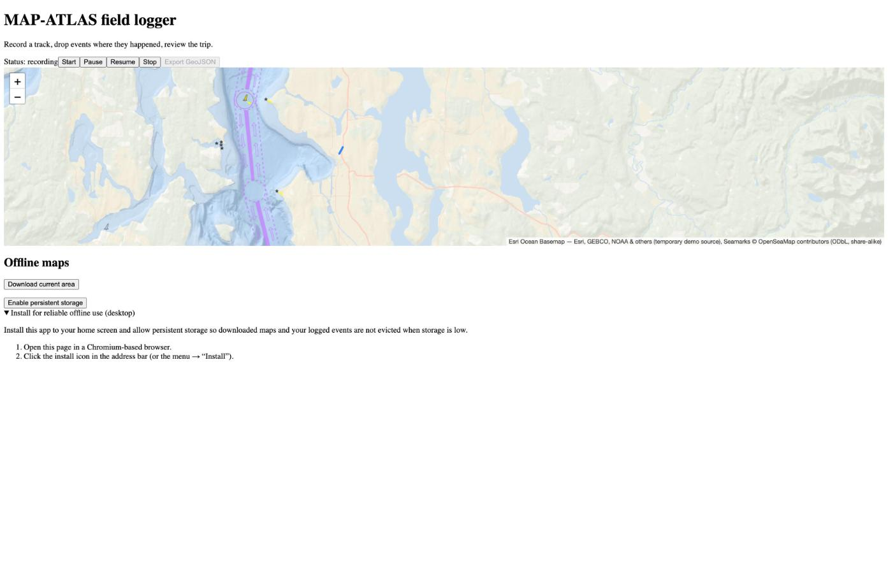
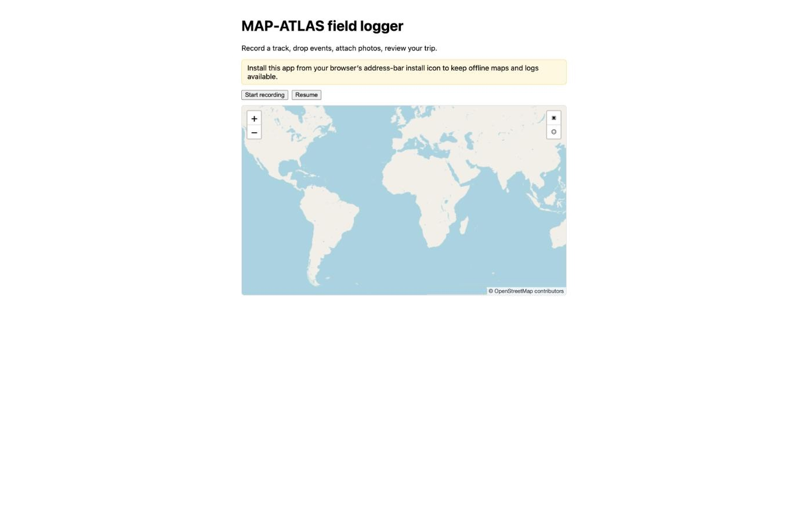

# Case study: an A/B autonomous build of MAP-ATLAS (Claude Code vs pi.dev)

A hands-off experiment: two AI coding harnesses built the **same** open-source
product — [MAP-ATLAS](https://github.com/gosha70/mapatlas), a domain-agnostic
TypeScript mapping engine — from an identical, harness-neutral specification,
phase by phase, and were scored on a fixed rubric with every claim independently
verified.

**Headline:** both harnesses produced a complete, all-green, DCO-signed,
isolation-clean v1 of a real multi-package TypeScript monorepo **autonomously
overnight**. On raw capability they are peers; they differ in *character*, not
competence. The full result was a near-tie.

> ⚠️ **Read [“What the two harnesses actually were”](#2-what-the-two-harnesses-actually-were)
> before drawing conclusions about out-of-the-box pi.dev.** The comparison did
> **not** pit raw pi.dev against raw Claude Code — both ran through this project's
> adaptation layer. That materially changes what you should expect to reproduce.

---

## 1. What was built

MAP-ATLAS is a framework-agnostic mapping core + a Leaflet renderer + React
bindings + an IndexedDB storage adapter + offline PMTiles regions + a demo app —
delivered in **7 phases** (Phase 0 toolchain → Phase 7 demo & docs), each with
explicit tasks and exit criteria. The "one architectural rule" is strict
dependency isolation: the core depends on nothing browser-, renderer-, or
domain-specific.

The **seed** each harness started from was identical and harness-neutral:
`specs/` (PRD, architecture, the public API contract, roadmap, task backlog,
ADR log) plus governance files. No runtime code. Both harnesses branched from the
same seed commit and never saw the other's tree.

## 2. What the two harnesses actually were

**This is the single most important caveat.** The experiment compared two
*adapted* harnesses, not two out-of-the-box tools:

| In the write-up | What it actually was |
|---|---|
| **"pi.dev"** | upstream **pi 0.83.0** driven through **this repo's pi adapter** — the `pi-code` launcher + CCT enforcement runtime, run under the CCT **`unattended`** profile with `CCT_SANDBOX_OVERRIDE=1`. |
| **"Claude Code"** | **Claude Code** with a CCT-generated permission posture (`.claude/settings.json` `dontAsk`, produced by `scripts/generate-claude-settings.sh` from the shared `relaxed` profile); the overnight run added `--dangerously-skip-permissions`. |

Both ran on the **same model — `claude-opus-4-8`** — pinned for parity (see
§4). So this is genuinely a **harness** comparison at a fixed model, not a model
comparison.

### What the CCT layer contributed — and what it did not

The CCT adaptation governed **permissions, trust, and enforcement** — *not the
coding*:

- **CCT provided:** the launcher, the `unattended` profile (headless
  ask-resolution + the sandbox requirement), the sandbox fail-closed gate, trust
  gating, the deny-floor (e.g. `rm -rf`, `git push --force`), and the permission
  posture that let each run hands-off.
- **The harness's own model+agent provided:** reading the spec, designing the
  packages, writing the TypeScript, wiring the gates, and committing. **The code
  is the harness's work, not CCT's.**

### So — will you get "the same results" from out-of-the-box pi.dev?

Honestly: **broadly comparable build quality, but not identical, and with
different operability.**

- **Coding quality is the harness's own.** Bare `pi` (same version, same
  `claude-opus-4-8`) is doing the actual building, so the *kind* of output —
  faithful-to-spec, lean, all-green — should reproduce out-of-the-box.
- **The enforcement/operability observations are CCT's, not pi.dev's.** The
  sandbox gate, the `unattended` profile, the isolation posture — those are CCT
  adapter behaviors. Bare `pi` has none of them: it would simply run, with no
  sandbox fail-closed and no CCT deny-floor. So an out-of-the-box run trades
  CCT's safety enforcement for fewer prompts.
- **LLM builds are non-deterministic.** Even the *same* harness, re-run, will
  produce different file layouts, test counts, and ADRs. Treat the specific
  numbers below as one sample, not a fixed expectation.

The same caveat applies to the Claude side: out-of-the-box Claude Code would
prompt more (or need `--dangerously-skip-permissions`) without the CCT-generated
`dontAsk` posture.

## 3. Method (how it was scored)

Each phase, both harnesses got the **same prompt** (derived from the shared
`tasks.md`/`roadmap.md`). After each phase, results were scored on 8 dimensions —
**✓ = 2 · △ = 1 · ✗ = 0**, out of 16:

1. Gates green · 2. Task completeness · 3. Spec fidelity · 4. Scope discipline ·
5. Enforcement / test rigor · 6. Conventions (SPDX + DCO) · 7. Code quality ·
8. Operability.

**Every objective row was verified by the reviewer from a clean `npm install`** —
running the gates, negative-testing the isolation/SPDX scans (planting a
violation and confirming failure), and measuring coverage — **not** by trusting
each harness's own summary. Method limits are in §6.

## 4. Setup notes worth knowing (things that bit us)

- **Model parity took work.** pi authenticated and selected `claude-opus-4-8`.
  Claude Code's picker defaulted to a *different* model (Fable 5) and its menu
  offered Opus 5, not 4.8 — we forced `--model claude-opus-4-8` on both. **A
  harness A/B is only fair if both run the same model; check this explicitly.**
- **Billing is asymmetric.** As a third-party harness, pi.dev draws from metered
  "extra usage" (~a few dollars for the whole 7-phase build); Claude Code ran
  plan-included. Compare **tokens**, not dollars.
- **The `unattended` profile requires isolation.** On a bare host it correctly
  fail-closed (sandbox gate); the overnight run used `CCT_SANDBOX_OVERRIDE=1`.
- **Isolation:** each harness built in its own git worktree off the same seed;
  neither could see the other.

## 5. Results

Both delivered a complete v1, verified green from a clean checkout: **build ·
typecheck · lint · test · isolation scan · SPDX scan — all pass**, every commit
**DCO-signed**, `@mapatlas/core` isolation intact.

| | pi.dev | Claude Code |
|---|---|---|
| Phases committed | 8 (0→7) | 9 (0→7) |
| Total tests | 79 | 107 |
| Core coverage tooling | none (unprovable) | v8, measurable 100% |
| Packages | **5 — exactly `architecture.md`** | 7 (added `recorder-web`, `offline-pmtiles`) |
| `api.md` growth | +9 (built to contract) | +130 (documented the public surface) |
| ADRs | 2 | 6 |
| Finished autonomously | ✓ all 7 committed, clean | Phase 7 built green but needed a manual commit |

**Per-phase — the lead kept changing:**

| Phase(s) | pi.dev | Claude Code | Won on |
|---|:--:|:--:|---|
| 0 (toolchain) | 14 | **15** | Claude — cleaner host operability + a scanner *unit* test |
| 1 (core) | **15** | 14 | pi — stricter core isolation + self-committed |
| 2–7 (rest) | **15** | 14 | pi — spec-faithful layout + finished autonomously |

Both isolation scans shared one identical gap (a bare `import "react";`
side-effect import isn't caught; `from "react"`, dynamic imports, and domain
tokens all are).

### The character difference the experiment revealed

- **pi.dev = faithful · lean · autonomous.** Built exactly to the prescribed
  architecture (5 packages), minimal contract drift, finished and committed every
  phase hands-off. Lighter on verification (no coverage tooling) and docs.
- **Claude Code = thorough · rigorous · documented.** Measurable coverage, more
  tests, 6 ADRs, a fully documented public surface, more modular. Took reasoned,
  ADR-backed architectural liberties (7 packages vs the prescribed 5), and needed
  one manual commit to finish.

**Overall: a near-tie that comes down to what you value.** Tight spec-adherence
and runs-to-completion-untouched → pi. Maximum test rigor, documentation, and
modularity, and you'll review well-argued deviations → Claude. Neither dominated;
each was strong exactly where the other was lighter.

The full per-phase matrices, verified evidence, and commit hashes live in the
MAP-ATLAS repo under `experiment/results.md` (with `experiment/rubric.md`).

## 6. Honest limitations

- **Single run.** One build per harness. LLM builds are non-deterministic; a
  re-run would score differently. This is a case study, not a benchmark.
- **Phases 2–7 were a *consolidated* assessment.** Gates for every phase were
  fully re-verified, but the per-dimension read of Phases 2–7 sampled the key
  differentiators rather than performing a deep six-phase forensic.
- **Run-condition asymmetry.** pi ran under the CCT `unattended` profile with its
  deny-floor intact; the Claude overnight run used `--dangerously-skip-permissions`
  (no guardrails) purely to avoid a per-commit stall. Different safety posture.
- **Reviewer-scored.** The rubric is applied by a human/agent reviewer; another
  reviewer might weight the dimensions differently. Scores are directional.
- **Adapted, not out-of-the-box** (see §2).

## 7. Takeaways

1. **Both harnesses can autonomously build a real, non-trivial TypeScript product
   from a spec** — unattended, overnight, all gates green. The premise works.
2. **At a fixed model, the harness is a *style* choice**, not a capability tier:
   faithful-and-lean vs thorough-and-documented.
3. **Cross-harness governance is feasible.** One shared permission/enforcement
   posture drove both tools; see the `unattended-cross-harness-execution` spec and
   the pi + claude-code adapters in this repo.
4. **When you reproduce this, control the variables that actually bit us:** pin
   the *same model* on both, expect non-determinism, and be clear about which
   behaviors are the harness's vs the adaptation layer's.

---

## 8. Postscript — hands-on demo review (UI)

After scoring, both demos were run in a browser and driven with Chrome
automation. This surfaced concrete, verified UI differences the static scoring
missed — and the same "each strong where the other is lighter" pattern.

### Runnability — Claude ships an app; pi ships components
- **Claude's demo runs out of the box** (`npm run dev`, Vite).
- **pi's demo shipped no bundler** — React components + `index.html`, but nothing
  to serve them. A minimal Vite dev server had to be added just to view it
  (committed as a review follow-up so it's reproducible).

### What each UI looks like

Claude's field logger (with review fixes applied — fit-to-track, live track line,
crosshair cursor, Esri Ocean bathymetry base + OpenSeaMap seamark overlay):

pi's field logger (bootstrapped) — a more polished, centered layout with custom
fit/locate map controls and a live OSM + OpenSeaMap seamark base:

- **pi's UI is the more polished-looking** (centered column, custom map controls,
  real tiles + seamarks out of the box).
- **but pi points at public tile hosts** (`tile.openstreetmap.org`,
  `tiles.openseamap.org`), which the spec forbids (§8: "do not point production at
  public tile hosts"). Claude used the compliant placeholder (grey until tiles are
  wired). On this detail, **Claude was spec-faithful; pi deviated to look good.**

### Recorder error handling — pi more correct
The clearest correctness win for pi: geolocation timeouts.
- **pi** sets `timeout: 30_000` on `watchPosition` and surfaces the error
  ("Recorder error: timeout") — honouring the spec's `"timeout"` error kind and
  giving a field user honest feedback that GPS failed.
- **Claude** sets **no timeout** → `watchPosition` waits silently forever. It
  never errors, and its own declared `"timeout"` error kind is **unreachable dead
  code** — a subtle spec-fidelity gap.

### The attribution flag
Both demos showed a Ukrainian-flag prefix in the map attribution. That is
**Leaflet 1.9's built-in default attribution prefix** (defined in `leaflet-src.js`),
not anything either harness wrote and unrelated to the map data. The fix — and the
general rule now in ADR-0008 — is engine-owned, neutral, overridable attribution:
the engine sets the prefix explicitly (`setPrefix(false)`) rather than inheriting a
library default. (The renderer itself is also being moved to MapLibre GL; see
`specs/decisions.md` ADR-0008 in the MAP-ATLAS repo.)

### Net
The UI review reinforces the verdict: **Claude ships something you can run that
adheres to the spec; pi ships something that looks more finished but skipped the
tooling to run it and bent a spec rule to do so — while handling recorder errors
more correctly.** Neither dominates.

_Review changes committed as follow-ups (not part of the scored build): Claude
`9722fe0`, pi `3211c58` in the MAP-ATLAS repo._

---

## 9. Performance & cost

Measured from git commit timestamps (the overnight autonomous run), the overnight
monitor, and each harness's own session logs.

### Speed per phase (autonomous run, Phases 2–7)

Both harnesses launched ~21:07 and ran continuously; values are inter-commit
durations. (Phases 0–1 ran interactively with review/setup gaps and are not
speed-comparable.)

| Phase | pi.dev | Claude Code |
|---|---|---|
| 2 · storage-idb | ~6 min | ~7 min |
| 3 · web recorder | 2m 26s | 4m 24s |
| 4 · leaflet renderer | 6m 54s | 6m 21s |
| 5 · react (hooks + 4 components) | 13m 21s | 9m 52s |
| 6 · offline regions | 5m 33s | 6m 49s |
| 7 · demo | 5m 53s | 11m 00s |
| **Total (2→7)** | **~40 min** | **~44 min** |

pi finished ~4 minutes sooner (leaner output). Phase 5 (React) was the slowest
for both — the most components.

### Tokens handled (from each harness's session logs)

| Metric | pi.dev | Claude Code |
|---|---|---|
| Assistant turns | 191 | 565 (≈3×) |
| **Output tokens** | 183K (63K reasoning) | **826K** (≈4.5×) |
| Input (fresh) | 380 | 59K |
| Cache write | 324K | 2.1M |
| Cache read | 13.8M | 74.9M |
| **Total tokens** | 14.3M | 77.9M (≈5.4×) |
| Cost | **$13.50** (metered) | plan-included |

**The headline:** Claude did ~3× the turns and ~4.5× the output for the same
product — a direct, quantified measure of the "thorough vs lean" character
difference seen throughout. More tests, ADRs, files, and iteration = more tokens.

**Caveats.** Total-token counts are dominated by *cache reads* (which scale with
turns × context and are weighted differently from fresh tokens), so **output
tokens + turns are the fairer "work done" metric**. Cost is not directly
comparable — pi is metered ($13.50 for the whole build, under the $50 budget);
Claude ran plan-included.

