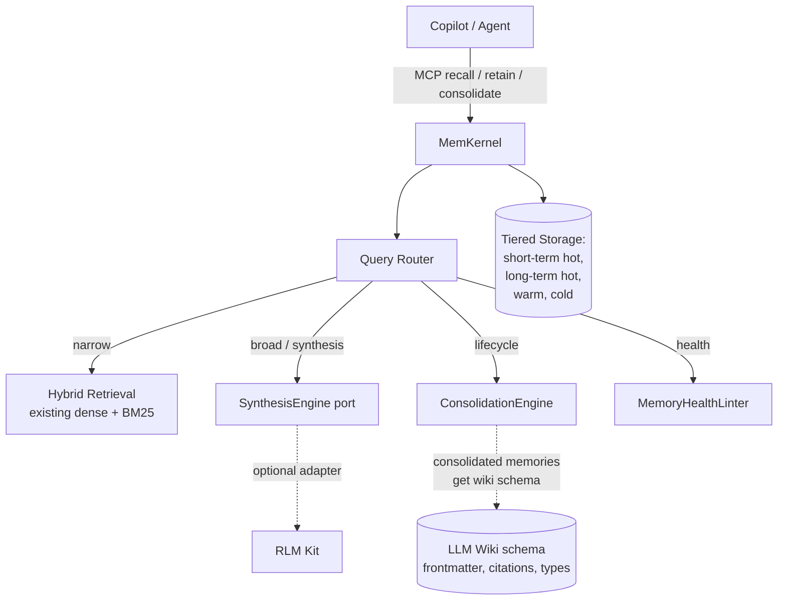
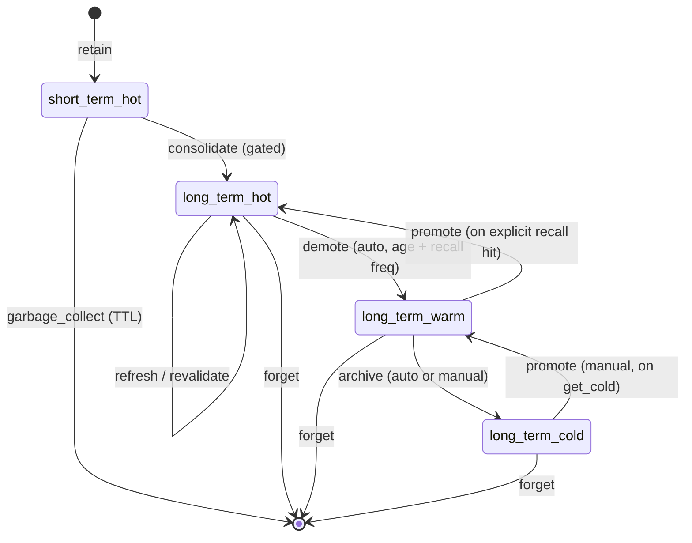

# Memory Brain Architecture

**This is a spec-first issue. No code changes land here.** The output is a load-bearing design artifact (`specs/memory-brain/spec.md`) that subsequent issues (#2 consolidate, #3 health-lint, #4 synthesis port, #5 RLM Kit adapter, #6 wiki schema for long-term partitions) reference as the architectural contract. Acceptance is the spec landing and validating; runtime behaviour is unchanged.

## 1. Problem Statement

Context windows are bounded. Even at 1M tokens, accuracy degrades sharply: published Claude evaluations show roughly 60% accuracy at half the maximum window. Larger context also raises cost and latency. The frontier-model trend doesn't close this gap — it shifts the boundary upward without removing it.

Existing agent frameworks (n8n, LangChain, LangGraph, MCP memory servers including memkernel today) provide **memory primitives**: persistence, vector recall, namespaces, thread state. They do not provide a **memory lifecycle**: explicit transitions between recency tiers, promotion of episodic experiences into durable knowledge, archival without deletion, contradiction detection, refresh/revalidation against drifting sources, garbage collection by usefulness rather than just age.

The product gap in AI copilots and agentic flows is therefore not memory persistence. It is **programmable memory lifecycle**. AI sessions accumulate decisions, conventions, code understanding, and incidents that should be consolidated, surfaced when relevant, archived when stale, and removed when invalid. Today's tools store; they do not curate.

MemKernel today is a memory store with hybrid retrieval. The four primitives (`retain`, `recall`, `get`, `forget`) and four memory types (`decision`, `convention`, `code`, `episode`) cover storage well. They do not cover lifecycle. This spec defines the architecture under which lifecycle becomes a first-class memkernel capability — turning memkernel from a memory store into a memory brain.

## 2. Proposed Architecture

Three components with disjoint concerns:

| Component | Owns | Does not own |
|---|---|---|
| **MemKernel** | Memory policy, lifecycle, query routing | Recursive exploration; durable knowledge schema |
| **RLM Kit** | Recursive exploration over large structured content | Memory persistence; lifecycle decisions |
| **LLM Wiki** | Durable, source-controlled, schema-validated knowledge structure | Runtime memory; vector retrieval |

Composition principle: copilots and agents talk to memkernel only. Memkernel decides whether a query is satisfied by flat retrieval, requires synthesis (calls into a `SynthesisEngine` port; RLM Kit is one possible implementation), or is a lifecycle/health question (calls into the consolidation or lint engines). The copilot does not select partitions or engines; that's memkernel's job.



Three properties this architecture preserves:

1. **No mandatory LLM dependency at runtime.** Memkernel can run with the synthesis port wired to a stub or a deterministic engine. RLM Kit is opt-in.
2. **No coupling between memory policy and synthesis engine.** The router is a memkernel concern; the engine is swappable.
3. **No new mandatory schema for short-term memory.** Long-term partitions adopt LLM Wiki structure (issue #6); short-term episodes stay loose.

## 3. Memory Tier Model

Four tiers, two timescales:

| Tier | Recency | Storage | Retrieval semantics | Maps to today's memkernel |
|---|---|---|---|---|
| `short_term.hot` | recent (default 30-day window) | primary vector index | full hybrid recall, default top-k | `episode` type |
| `long_term.hot` | active long-term | primary vector index | full hybrid recall, with optional reranking | `decision`, `convention`, `code` types when frequently recalled |
| `long_term.warm` | archived but searchable | secondary index, lazy-loaded | requires explicit `include_warm=True` on recall | new tier — no current equivalent |
| `long_term.cold` | retained artifacts, offline | object storage / blob | manual retrieval by `ref_id` only, no vector search | new tier — no current equivalent |

**Per-tier policies:**

- **Volatility.** `short_term.hot` expires by TTL (default 30 days, configurable per project). `long_term.*` is durable.
- **Searchability.** Hot tiers participate in default `recall`. Warm requires opt-in. Cold requires explicit retrieval by reference.
- **Cost shape.** Hot tiers stay in the active vector index. Warm tiers may use a smaller embedding dimension or a separate index to reduce hot-index cost. Cold tiers carry no embedding cost.
- **Cross-project visibility.** Tiers are project-scoped; `MEMKERNEL_PROJECT_ID` continues to isolate them. Cross-project queries are out of scope for this issue.

**Migration from today's memkernel:** existing `episode` memories become `short_term.hot`; existing `decision`/`convention`/`code` memories become `long_term.hot`. No data migration required at the storage layer; the tier label is metadata. Warm and cold tiers are new and start empty.

## 4. Lifecycle State Machine

Eight operations defined here as contracts; implementations land in subsequent issues.



| Operation | Source tier(s) | Destination tier | Trigger | Gate | Provenance |
|---|---|---|---|---|---|
| `retain` | none | `short_term.hot` (default) or `long_term.hot` (explicit type) | agent / MCP call | none | source tag, session_id, timestamp |
| `recall` | `short_term.hot`, `long_term.hot` | (read only) | agent / MCP call | none | logged for recall-frequency tracking |
| `consolidate` | `short_term.hot` | `long_term.hot` | scheduled or agent-initiated | four-question gate (cct's wiki ingest gate) | preserves episode reference + reason |
| `promote` | `long_term.warm` → `long_term.hot`; `long_term.cold` → `long_term.warm` | one tier up | recall hit on warm; explicit `get_cold` for cold | none for warm-recall-driven; manual confirmation for cold | recall count incremented |
| `demote` | `long_term.hot` → `long_term.warm` | one tier down | scheduled (age threshold + recall-frequency floor) | none, automatic | demotion timestamp + last-recall timestamp |
| `archive` | `long_term.warm` → `long_term.cold` | cold | scheduled or manual | none, automatic | archive timestamp |
| `forget` | any tier | none | agent / MCP call or admin | confirmation for `long_term.hot` | tombstone retained for audit (configurable) |
| `refresh` / `revalidate` | `long_term.hot`, especially `code` type | same tier or marked-for-review | scheduled or on source change | none | revalidation timestamp; if source missing, memory marked `needs_review` |
| `garbage_collect` | `short_term.hot` past TTL | none | scheduled | none, automatic | gc timestamp |

**Promotion gate (consolidate).** Reuses cct's four-question gate as the policy for whether an episode promotes to a long-term memory: reusable beyond one session, citable, non-duplicative, new-contributor-relevant. This issue defines that the gate exists; issue #2 implements the consolidate operation that applies it.

**Demotion policy.** A `long_term.hot` memory demotes to `warm` when both: (a) `time_since_last_recall > demote_age_threshold` (default 90 days) and (b) `recall_count_in_window < frequency_floor` (default 1 per quarter). Both are configurable per-project. A memory recalled at any time auto-promotes back from `warm` to `hot`.

**Archival policy.** A `long_term.warm` memory archives to `cold` when `time_since_demotion > archive_age_threshold` (default 365 days). Cold memories never auto-promote; promotion requires explicit `get_cold(ref_id)`.

**Refresh policy.** Initially scoped to `code` type memories: when the source file referenced in the memory's provenance is modified or removed, the memory is marked `needs_review` and excluded from default recall until refreshed. Implementation deferred to a later issue; this spec just names the policy.

## 5. Routing Layer

A new conceptual entry point inside memkernel — `route_query` — classifies incoming queries and dispatches to the appropriate engine. The classifier is heuristic (no LLM call required for triage); explicit override is supported.

| Query shape | Heuristic signal | Dispatched to | Example |
|---|---|---|---|
| Identifier lookup | query matches a known slug, function name, or class name in the index | existing hybrid retrieval | `recall("PostgresAdapter")` |
| Narrow natural-language recall | short query, < 8 words, no synthesis verbs | existing hybrid retrieval | `recall("database choice")` |
| Broad synthesis | query contains "why", "evolution", "across", "summarize", "contradiction", "compare", "history of" | `SynthesisEngine` port | `recall("why did we choose this architecture")` |
| Lifecycle / consolidation | query asks "what should I promote / archive / forget" | `ConsolidationEngine` | meta-query, typically agent-initiated |
| Health / lint | query asks "find contradictions / stale / orphans" | `MemoryHealthLinter` | meta-query, typically curator-initiated |

**Override.** All MCP recall-shaped tools accept an optional `route` parameter (`flat` / `synthesis` / `consolidation` / `health`) that bypasses the classifier. Default is auto-classification. The classifier records its decision in the result metadata so callers can debug routing behaviour.

**Backwards compatibility.** Default `recall(query)` calls still behave like today's memkernel for queries the classifier categorises as identifier or narrow-recall — which is the dominant case. The router only escalates when the classifier signals broad-synthesis or lifecycle/health.

**Failure modes.** When the router escalates to `SynthesisEngine` and the engine is not configured, the router returns the flat-retrieval result with a metadata note that synthesis was requested but unavailable. It does not silently degrade quality without telling the caller.

## 6. Synthesis Port

A protocol-level contract, defined here, implemented in issue #4 (stub) and issue #5 (RLM Kit adapter). Naming preference: `SynthesisEngine` (most concrete; alternatives `WorldExplorer`, `ContextNavigator` are more aspirational and less precise about what the port does).

```python
from typing import Protocol

class SynthesisEngine(Protocol):
    def synthesize(
        self,
        query: str,
        working_set: list[Memory],
        policy: SynthesisPolicy,
    ) -> SynthesisResult: ...

    def health_check(self) -> EngineHealth: ...
```

**`SynthesisPolicy`.** Configuration for a single synthesis call: `max_input_tokens`, `max_recursion_depth`, `include_trace`, `timeout_seconds`. All optional with defaults pulled from per-project config.

**`SynthesisResult`.** `answer` (string), `citations` (list of `Memory` references from `working_set` the engine actually used), `trace` (optional list of intermediate steps if `include_trace=True`), `confidence` (string: `high` / `medium` / `low` / `unavailable`), `engine_metadata` (free-form: which engine, version, token counts if applicable).

**`EngineHealth`.** Returns whether the engine is configured, callable, and within rate / cost limits. Used by the router to decide whether to attempt synthesis or fall back to flat retrieval with a note.

**Working set construction.** Memkernel populates `working_set` before calling `synthesize`. The default policy: pull a high-`k` candidate set via existing hybrid retrieval (e.g., `k=50`), filtered to `long_term.hot` and recent `short_term.hot`, deduplicated, ordered by retrieval score. The engine receives this set and decides how to navigate it. Engines do not call back into memkernel for additional retrieval in v1 — the working set is one-shot. If an engine needs iterative retrieval, that's a v2 capability addressed when issue #5 evaluates RLM Kit's recursive-controller fit.

**First implementation (issue #4).** A `NullSynthesisEngine` that returns `SynthesisResult(answer="<synthesis not configured>", citations=[], confidence="unavailable", engine_metadata={"engine": "null"})`. The router detects unavailable confidence and falls back to flat retrieval. This lets the routing layer ship and be tested before any real synthesis engine exists.

**Real implementation (issue #5).** `RLMSynthesisEngine` adapts RLM Kit's recursive controller behind this port. RLM Kit is not memkernel's dependency; it's a peer package the adapter imports. Memkernel's core has no `import rlmkit` anywhere; only the adapter module does, and only when explicitly enabled by config.

## 7. Acceptance Criteria

- [x] `specs/memory-brain/spec.md` lands in the memkernel repo, structured as the seven sections above (problem, architecture, tier model, lifecycle, routing, synthesis port, acceptance).
- [x] Spec validates against memkernel's spec-validation pipeline (memkernel has none yet; this document satisfies the minimal bar in lieu of one: frontmatter present, required sections present, no TODOs in body).
- [x] **No runtime behaviour change.** Existing `retain`/`recall`/`get`/`forget` MCP tools behave exactly as today. Existing memory types continue to work. The `short_term.hot` and `long_term.hot` tier labels are added as metadata on existing memories with no functional effect until subsequent issues land.
- [x] **No mandatory LLM dependency added.** No new requirements in `pyproject.toml`, no new env vars required at startup. The synthesis port exists as a protocol; no implementation is wired in.
- [x] **The four documents subsequent issues need are present in the spec:**
  - The tier model with explicit transitions (drives issues #2, #6) — §3.
  - The lifecycle state machine with operation contracts (drives issues #2, #3, #6) — §4.
  - The routing rubric with classifier signals (drives issues #2, #3, #4) — §5.
  - The synthesis port protocol with policy/result types (drives issues #4, #5) — §6.
- [x] **Cross-references are stable.** Issues #2 (consolidate), #3 (health-lint), #4 (synthesis port), #5 (RLM adapter), #6 (wiki schema for long-term partitions) reference the spec by section number (§1–§7 above) and remain stable as those issues are scoped in detail.
- [x] **The spec explicitly names what is out of scope** (see below) so subsequent issues don't accidentally inherit.

## Out of scope

- Implementation of any of the eight lifecycle operations (issues #2, #3, and a future #N).
- The first concrete `SynthesisEngine` implementation (issue #4 stub, issue #5 RLM adapter).
- Wiki-schema adoption inside long-term partitions (issue #6).
- Cross-project memory queries.
- Distributed memkernel (multi-node).
- A web UI for memory inspection.
- Migration tooling for existing memkernel deployments — none needed in this issue because no data shape changes; the tier labels are additive metadata.

## Implementation note for issues 2 and 4 only

Per the campaign-scope discipline (avoid drafting all six issues in detail before the architecture proves itself):

- **Issue #2 (consolidate operation)** will be specced in detail immediately after this lands, against this spec's tier model and lifecycle state machine.
- **Issue #4 (synthesis port)** will be specced in detail immediately after this lands, against this spec's synthesis port section.
- **Issues #3, #5, #6** stay as one-paragraph stubs until issues #2 and #4 ship and surface what's actually needed. Their detailed scoping is deferred to avoid the same scope-drift trap that affected cct PR #27 before its rescope.

## Sources

- HRM (Hierarchical Reasoning Model) reference for the two-timescale reasoning principle: https://arxiv.org/abs/2506.21734.
- Karpathy LLM Wiki gist for the durable-knowledge-structure layer: https://gist.github.com/karpathy/442a6bf555914893e9891c11519de94f.
- cct's wiki ingest gate (four-question): `gosha70/code-copilot-team` PR #27 (merged), `knowledge/wiki/schema/ingest-rules.md`.
- rlmkit#37 for the recursive-synthesis pattern this spec adopts via the `SynthesisEngine` port.
